# WiFly485 - RS485 WiFi中继系统

基于ESP8266的RS485 WiFi透明传输解决方案，实现VRF控制器与新风系统之间的无线通信中继。

## 🚀 项目特性

- **透明传输**: RS485信号通过WiFi网络透明传输
- **统一固件**: 服务端和客户端使用同一套代码，通过编译宏区分
- **自动配置**: WiFi热点配置模式，简化安装过程
- **稳定可靠**: 自动重连、心跳检测、错误恢复机制
- **状态指示**: 完整的LED状态指示系统
- **Web配置**: 内置Web服务器进行参数配置

## 🏗️ 系统架构

```mermaid
graph LR
    A[VRF控制器] -->|RS485| B[服务端模式<br>ESP8266]
    B -->|WiFi| C[路由器]
    C -->|WiFi| D[客户端模式<br>ESP8266]
    D -->|RS485| E[新风系统]
```



## 📋 硬件需求

- **主控**: ESP8266开发板
- **通信**: MAX3485 RS485转换模块
- **电源**: 5V或3.3V电源
- **网络**: 2.4GHz WiFi路由器

## 🔧 快速开始

### 1. 环境准备

```bash
# 安装PlatformIO
pip install platformio

# 克隆项目
git clone https://github.com/davidhoo/WiFly485.git
cd WiFly485
```

### 2. 编译固件

```bash
# 编译服务端版本
pio run -e esp12e_server

# 编译客户端版本
pio run -e esp12e_client
```

### 3. 烧录固件

```bash
# 烧录服务端固件
pio run -e esp12e_server --target upload

# 烧录客户端固件
pio run -e esp12e_client --target upload
```

### 4. 配置网络

1. 设备上电后自动启动WiFi热点：`WiFly485_Repeater_XXXX`
2. 连接热点后访问：`192.168.4.1`
3. 通过Web界面配置WiFi参数
4. 配置完成后自动重启并连接路由器

## 📁 项目结构

```
WiFly485/
├── src/
│   └── main.cpp          # 主程序文件
├── include/              # 头文件目录
├── lib/                  # 库文件目录
├── test/                 # 测试文件目录
├── platformio.ini        # PlatformIO配置文件
├── 需求文档.md           # 详细需求文档
└── README.md             # 项目说明
```

## 🛠️ 开发环境

- **框架**: Arduino
- **平台**: ESP8266
- **IDE**: PlatformIO / VSCode
- **语言**: C++

## 📊 技术规格

| 参数 | 规格 |
|------|------|
| WiFi标准 | 802.11 b/g/n |
| 通信速率 | 1200-115200 bps |
| 工作电压 | 3.3V |
| 工作温度 | -20°C ~ +70°C |

## 🔄 开发流程

本项目采用GitHub Flow开发流程：

1. 从`main`分支创建功能分支
2. 完成功能开发
3. 创建Pull Request
4. 代码审查后合并

## 📄 许可证

MIT License - 详见LICENSE文件

## 🤝 贡献

欢迎提交Issue和Pull Request！

## 📞 联系

- 项目地址: [https://github.com/davidhoo/WiFly485](https://github.com/davidhoo/WiFly485)
- 问题反馈: [GitHub Issues](https://github.com/davidhoo/WiFly485/issues)