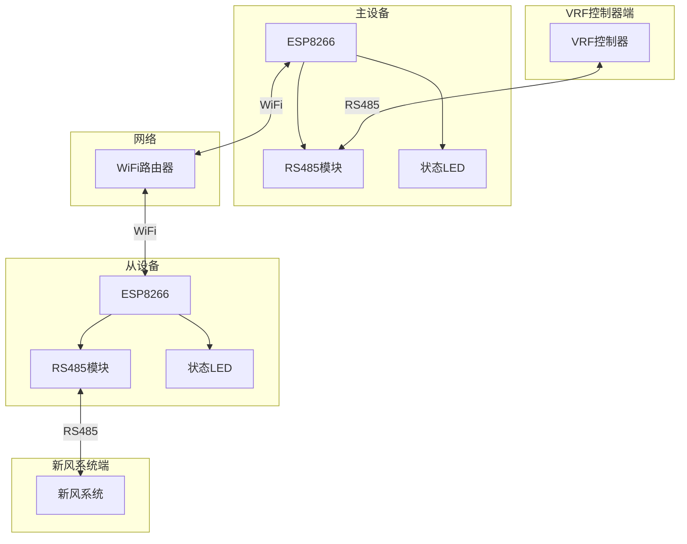
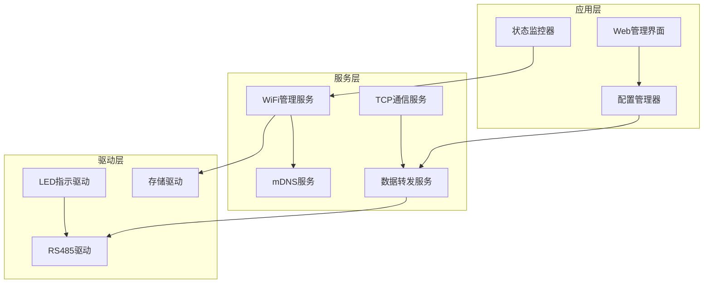

# WiFly485 个人开发计划

## 项目概述

**项目名称**：WiFly485 RS485 WiFi中继系统  
**开发模式**：个人开发  
**核心目标**：实现RS485信号的WiFi无线中继传输

### 核心功能
- RS485信号的WiFi无线中继传输
- 主从设备自动发现和配置同步
- Web管理界面
- 系统稳定性保证

---

## 系统架构

### 硬件架构


### 软件架构


---

## 开发步骤

### 阶段1：基础环境搭建

#### 1.1 开发环境配置
**目标**：建立可工作的开发环境
**步骤**：
1. 配置PlatformIO环境
2. 创建主从设备编译配置
3. 安装必要的库依赖
4. 验证编译和上传功能

**验收标准**：
- 主从设备固件能正常编译
- 能成功上传到ESP8266
- 串口输出正常

#### 1.2 硬件抽象层
**目标**：建立硬件接口抽象
**步骤**：
1. 实现GPIO控制接口
2. 实现UART控制接口
3. 实现WiFi控制接口
4. 实现文件系统接口

**验收标准**：
- 各硬件接口功能正常
- 接口调用无异常

#### 1.3 基础服务框架
**目标**：建立服务管理框架
**步骤**：
1. 创建服务管理器类
2. 实现事件驱动架构
3. 建立日志输出系统
4. 设计错误处理机制

**验收标准**：
- 服务管理器正常工作
- 日志输出清晰
- 错误处理有效

### 阶段2：核心功能开发

#### 2.1 配置管理系统
**目标**：实现配置文件管理
**步骤**：
1. 实现ConfigManager类
2. 设计JSON配置结构
3. 添加配置验证逻辑
4. 创建默认配置文件

**验收标准**：
- 配置文件正常读写
- 配置验证机制有效
- 默认配置正确生成

#### 2.2 LED状态指示系统
**目标**：实现设备状态指示
**步骤**：
1. 实现LEDIndicator类
2. 定义LED状态枚举
3. 实现状态优先级逻辑
4. 添加调试输出功能

**验收标准**：
- LED状态显示正确
- 状态切换平滑
- 调试信息清晰

#### 2.3 WiFi连接管理
**目标**：实现WiFi连接功能
**步骤**：
1. 实现WiFiManager类
2. 添加AP模式功能
3. 实现STA连接逻辑
4. 建立重连机制

**验收标准**：
- WiFi热点模式正常
- STA模式连接稳定
- 自动重连有效

### 阶段3：通信协议实现

#### 3.1 RS485通信基础
**目标**：实现RS485硬件通信
**步骤**：
1. 实现RS485Manager类
2. 配置UART参数
3. 实现方向控制逻辑
4. 添加时序管理机制

**验收标准**：
- RS485数据正常收发
- 方向控制准确
- 时序管理有效

#### 3.2 TCP通信实现
**目标**：实现TCP网络通信
**步骤**：
1. 实现TCPServer类（主设备）
2. 实现TCPClient类（从设备）
3. 添加连接管理逻辑
4. 实现数据缓冲机制

**验收标准**：
- TCP连接稳定
- 数据传输正常
- 连接管理有效

#### 3.3 数据转发服务
**目标**：实现透明数据转发
**步骤**：
1. 实现DataForwarding类
2. 建立双向转发逻辑
3. 添加数据校验机制
4. 实现流量控制算法

**验收标准**：
- 数据透明转发正常
- 数据完整性保证
- 流量控制有效

### 阶段4：集成测试

#### 4.1 单元测试
**目标**：验证各模块功能
**步骤**：
1. 测试配置管理功能
2. 测试WiFi连接功能
3. 测试RS485通信功能
4. 测试TCP通信功能

#### 4.2 集成测试
**目标**：验证系统整体功能
**步骤**：
1. 测试主从设备通信
2. 测试数据转发功能
3. 测试配置同步功能
4. 测试错误恢复功能

#### 4.3 端到端测试
**目标**：验证完整业务流程
**步骤**：
1. 搭建完整测试环境
2. 模拟真实使用场景
3. 验证性能指标
4. 测试长期稳定性

### 阶段5：高级功能

#### 5.1 mDNS服务
**目标**：实现设备自动发现
**步骤**：
1. 实现mDNS服务注册
2. 实现设备发现逻辑
3. 添加服务状态监控
4. 实现故障转移机制

#### 5.2 配置同步
**目标**：实现主从配置同步
**步骤**：
1. 设计配置同步协议
2. 实现配置比较逻辑
3. 添加同步状态管理
4. 实现冲突解决机制

#### 5.3 Web管理界面
**目标**：提供Web管理功能
**步骤**：
1. 设计Web界面结构
2. 实现设备状态显示
3. 添加配置修改功能
4. 实现系统监控功能

### 阶段6：优化和部署

#### 6.1 性能优化
**目标**：优化系统性能
**步骤**：
1. 分析性能瓶颈
2. 优化内存使用
3. 优化网络通信
4. 优化数据处理

#### 6.2 稳定性测试
**目标**：确保系统稳定性
**步骤**：
1. 长期运行测试
2. 压力测试
3. 异常情况测试
4. 恢复能力测试

#### 6.3 部署文档
**目标**：完善部署文档
**步骤**：
1. 编写安装指南
2. 编写配置说明
3. 编写故障排除指南
4. 编写维护手册

---

## 技术规格

### 硬件规格
- **主控芯片**：ESP8266EX
- **工作频率**：80MHz/160MHz
- **Flash存储**：4MB
- **RAM内存**：~80KB可用
- **WiFi标准**：802.11 b/g/n
- **RS485芯片**：SP3485

### 性能指标
- **端到端延迟**：< 50ms
- **数据包丢失率**：< 0.1%
- **系统可用性**：> 99.9%
- **内存使用率**：< 80%
- **WiFi连接稳定性**：> 99%

### 关键接口定义

#### 配置管理接口
```cpp
class IConfigManager {
public:
    virtual bool loadConfig() = 0;
    virtual bool saveConfig() = 0;
    virtual bool validateConfig() = 0;
    virtual String getConfigJson() = 0;
    virtual bool setConfigFromJson(const String& json) = 0;
};
```

#### RS485通信接口
```cpp
class IRS485Manager {
public:
    virtual bool initialize() = 0;
    virtual bool sendData(const uint8_t* data, size_t length) = 0;
    virtual size_t receiveData(uint8_t* buffer, size_t maxLength) = 0;
    virtual void setDirection(bool transmit) = 0;
    virtual bool isTransmitting() = 0;
};
```

#### TCP通信接口
```cpp
class ITCPManager {
public:
    virtual bool startServer(uint16_t port) = 0;
    virtual bool connectToServer(const char* host, uint16_t port) = 0;
    virtual bool sendData(const uint8_t* data, size_t length) = 0;
    virtual bool isConnected() = 0;
    virtual void disconnect() = 0;
};
```

---

## 开发环境配置

### PlatformIO配置
```ini
[env:esp12e_master]
platform = espressif8266
board = esp12e
framework = arduino
lib_deps = 
    ESP8266mDNS
    ESP8266WebServer
    ArduinoJson
build_flags =
    -DDEVICE_ROLE_MASTER
    -DDEVICE_NAME="WiFly485_Master"

[env:esp12e_slave]
platform = espressif8266
board = esp12e
framework = arduino
lib_deps = 
    ESP8266mDNS
    ESP8266WebServer
    ArduinoJson
build_flags =
    -DDEVICE_ROLE_SLAVE
    -DDEVICE_NAME="WiFly485_Slave"
```

### 主程序结构模板
```cpp
#include <Arduino.h>
#include "config_manager.h"
#include "wifi_manager.h"
#include "rs485_manager.h"
#include "tcp_manager.h"
#include "led_indicator.h"
#include "data_forwarding.h"

// 全局对象
ConfigManager configManager;
WiFiManager wifiManager;
RS485Manager rs485Manager;
LEDIndicator ledIndicator;

#ifdef DEVICE_ROLE_MASTER
TCPServer tcpServer;
#else
TCPClient tcpClient;
#endif

DataForwarding dataForwarding;

void setup() {
    Serial.begin(115200);
    Serial.println("WiFly485 Starting...");
    
    // 初始化各个模块
    ledIndicator.begin();
    configManager.loadConfig();
    wifiManager.begin();
    rs485Manager.begin();
    dataForwarding.begin();
    
    Serial.println("WiFly485 Started Successfully");
}

void loop() {
    // 更新各个管理器
    wifiManager.update();
    rs485Manager.update();
    ledIndicator.update();
    dataForwarding.update();
    
    delay(10);
}
```

---

## 测试和验证

### 功能测试清单
- [ ] 配置文件读写正常
- [ ] WiFi连接稳定
- [ ] RS485数据收发正常
- [ ] TCP通信稳定
- [ ] 数据透明转发正常
- [ ] LED状态指示正确
- [ ] Web界面功能完整
- [ ] 设备自动发现正常
- [ ] 配置同步成功
- [ ] 错误恢复有效

### 性能测试清单
- [ ] 端到端延迟 < 50ms
- [ ] 数据包丢失率 < 0.1%
- [ ] 内存使用率 < 80%
- [ ] 系统连续运行 > 24小时
- [ ] WiFi重连成功率 > 95%

### 部署验证清单
- [ ] 固件编译成功
- [ ] 固件烧录成功
- [ ] 设备正常启动
- [ ] 网络连接正常
- [ ] 主从设备通信正常
- [ ] 实际业务场景验证通过

---

## 常见问题排除

### 设备无法启动
1. 检查电源连接和电压
2. 重新烧录固件
3. 检查硬件连接

### WiFi连接失败
1. 验证WiFi凭据
2. 检查信号强度
3. 重启路由器

### 主从设备无法通信
1. 确认网络配置
2. 检查防火墙设置
3. 重启mDNS服务

### 数据传输异常
1. 检查RS485硬件连接
2. 调整时序参数
3. 检查电磁干扰

---

**文档版本**：v3.0.0 (简化版)  
**最后更新**：2025-08-08  
**适用场景**：个人开发