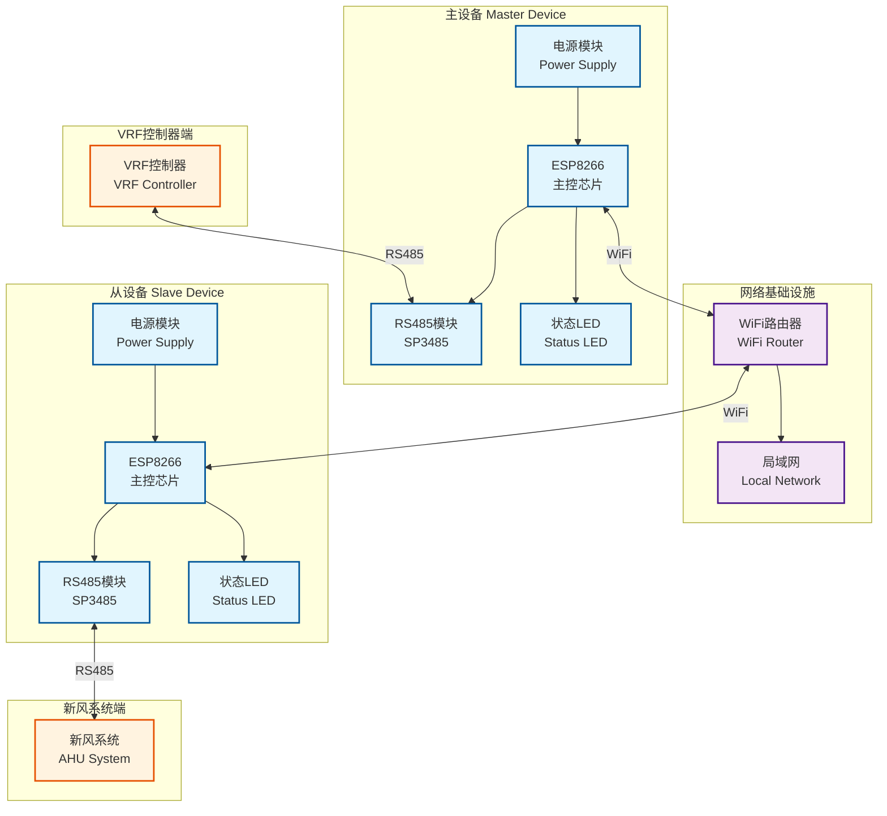
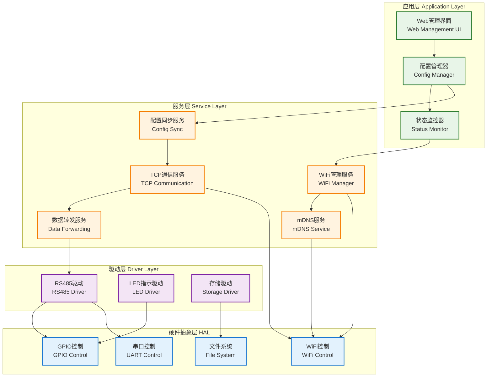
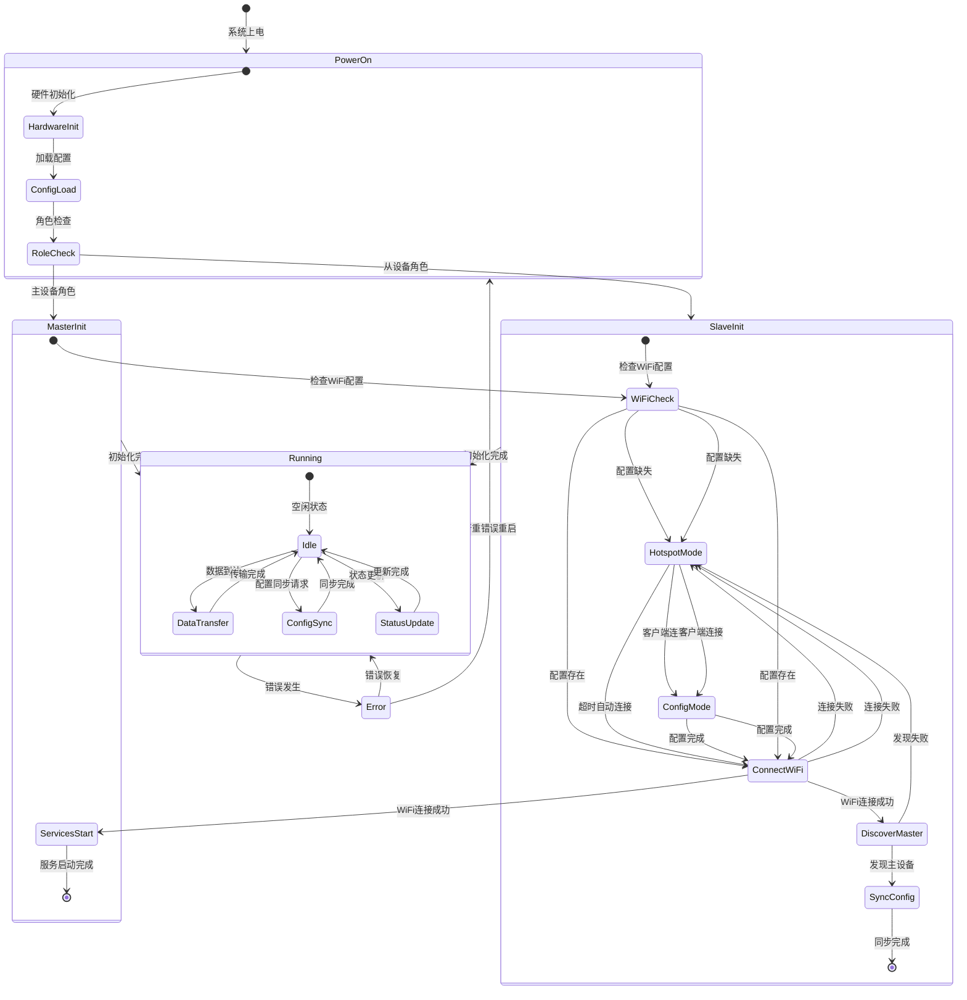
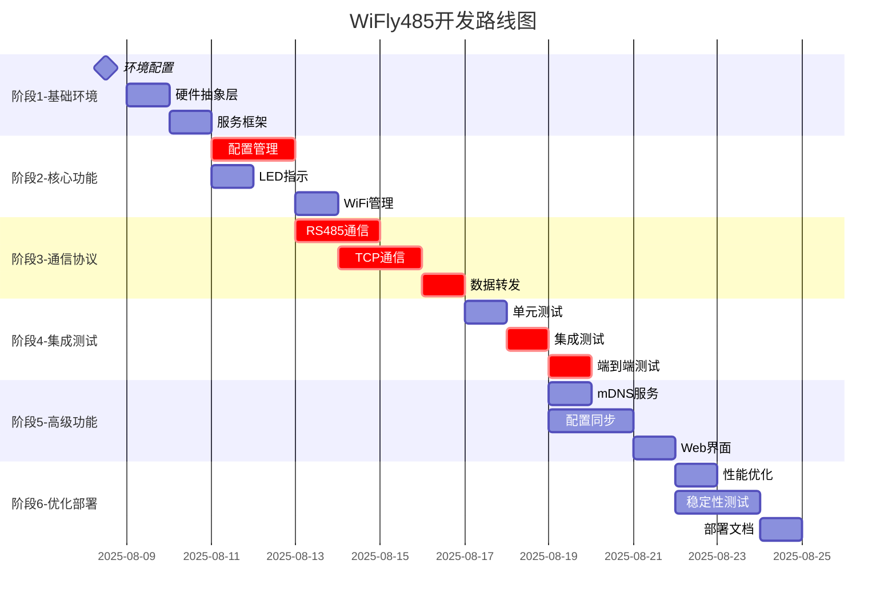
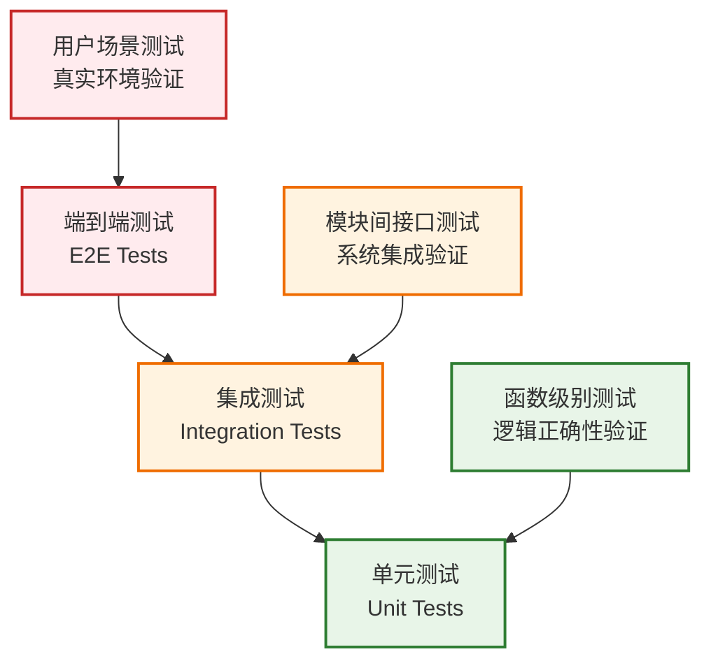
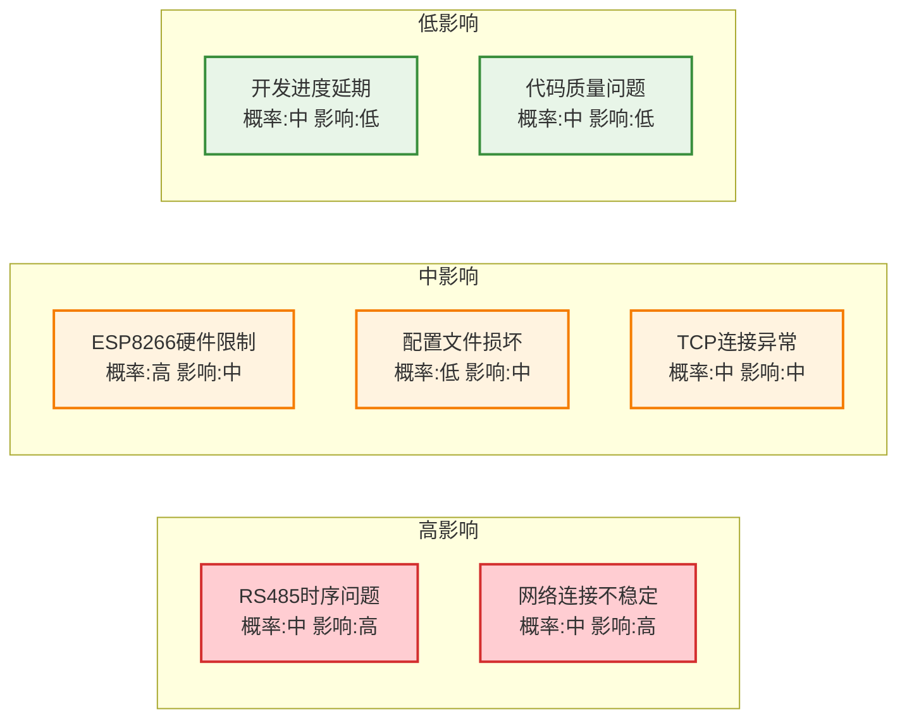

# WiFly485 RS485 WiFi中继系统开发计划

## 目录

1. [项目总览](#1-项目总览)
2. [系统架构设计](#2-系统架构设计)
3. [技术规格详述](#3-技术规格详述)
4. [开发路线图](#4-开发路线图)
5. [实施指南](#5-实施指南)
6. [质量保证](#6-质量保证)
7. [运维部署](#7-运维部署)
8. [风险管理](#8-风险管理)
9. [附录](#9-附录)

---

## 1. 项目总览

### 1.1 项目背景与目标

**项目名称**：WiFly485 RS485 WiFi中继系统

**核心价值主张**：
- 解决VRF控制器与新风系统之间的远程通信需求
- 消除传统有线RS485连接的距离限制和布线困难
- 提供稳定可靠的无线透明传输解决方案

**项目目标**：
- 实现RS485信号的WiFi无线中继传输
- 支持主从设备自动发现和配置同步
- 提供统一的Web管理界面
- 确保系统稳定性和可维护性

### 1.2 成功标准定义

**技术指标**：
- 数据传输延迟 < 50ms（端到端）
- 数据包丢失率 < 0.1%
- 系统可用性 > 99.9%
- 配置同步时间 < 5秒
- 错误恢复时间 < 30秒

**质量指标**：
- 代码覆盖率 > 80%
- 内存使用率 < 80%
- WiFi连接稳定性 > 99%
- 首次部署成功率 > 90%

### 1.3 项目约束条件

**硬件约束**：
- ESP8266内存限制（~80KB可用RAM）
- 单色LED状态指示限制
- RS485半双工通信限制

**网络约束**：
- 依赖2.4GHz WiFi网络
- 需要稳定的路由器环境
- DHCP强制模式

**开发约束**：
- 使用PlatformIO开发环境
- Arduino框架限制
- C++语言实现

---

## 2. 系统架构设计

### 2.1 硬件架构设计



### 2.2 软件架构设计



### 2.3 通信协议设计

#### 2.3.1 数据传输协议

**RS485到TCP封装格式**：
```json
{
  "protocol_version": "1.0",
  "message_type": "data_transfer",
  "timestamp": "2025-08-08T10:00:00.123Z",
  "device_id": "wifly485-master-a1b2c3",
  "sequence_id": 12345,
  "data": {
    "raw_bytes": [0x01, 0x03, 0x00, 0x00, 0x00, 0x01, 0x84, 0x0A],
    "length": 8,
    "checksum": "crc16_value",
    "direction": "tx|rx"
  }
}
```

#### 2.3.2 配置同步协议

**配置同步消息格式**：
```json
{
  "protocol_version": "1.0",
  "message_type": "config_sync_request|config_sync_response|config_update",
  "timestamp": "2025-08-08T10:00:00Z",
  "device_id": "wifly485-master-a1b2c3",
  "sequence_id": 12345,
  "payload": {
    "config": {
      "device": {...},
      "network": {...},
      "communication": {...},
      "system": {...}
    },
    "checksum": "sha256_hash",
    "force_update": false
  }
}
```

### 2.4 状态机设计



---

## 3. 技术规格详述

### 3.1 硬件技术规格

#### 3.1.1 ESP8266规格
| 参数 | 规格 | 说明 |
|------|------|------|
| 主控芯片 | ESP8266EX | 32位RISC处理器 |
| 工作频率 | 80MHz/160MHz | 可调节频率 |
| Flash存储 | 4MB | 程序和数据存储 |
| RAM内存 | ~80KB可用 | 用户可用内存 |
| WiFi标准 | 802.11 b/g/n | 2.4GHz频段 |
| 工作电压 | 3.3V | 稳定电源供应 |
| GPIO引脚 | 17个可用 | 数字输入输出 |

#### 3.1.2 RS485模块规格
| 参数 | 规格 | 说明 |
|------|------|------|
| 收发器芯片 | SP3485 | 半双工RS485收发器 |
| 工作电压 | 3.3V-5V | 兼容ESP8266电压 |
| 通信速率 | 最高10Mbps | 支持标准波特率 |
| 共模范围 | -7V到+12V | 抗干扰能力强 |
| 总线容量 | 最多32个节点 | 标准RS485规格 |
| 保护功能 | 短路保护 | 硬件安全保护 |

### 3.2 软件技术栈

#### 3.2.1 开发环境
```yaml
开发工具链:
  IDE: PlatformIO Core + VSCode
  框架: Arduino Framework
  编译器: GCC for Xtensa
  调试器: ESP8266 Serial Monitor
  版本控制: Git + GitHub

核心库依赖:
  - ESP8266WiFi: WiFi连接管理
  - ESP8266WebServer: Web服务器
  - ESP8266mDNS: 服务发现
  - ArduinoJson: JSON数据处理
  - LittleFS: 文件系统操作
```

#### 3.2.2 关键接口定义

**配置管理接口**：
```cpp
class IConfigManager {
public:
    virtual bool loadConfig() = 0;
    virtual bool saveConfig() = 0;
    virtual bool validateConfig() = 0;
    virtual void onConfigChanged() = 0;
    virtual String getConfigJson() = 0;
    virtual bool setConfigFromJson(const String& json) = 0;
};
```

**RS485通信接口**：
```cpp
class IRS485Manager {
public:
    virtual bool initialize() = 0;
    virtual bool sendData(const uint8_t* data, size_t length) = 0;
    virtual size_t receiveData(uint8_t* buffer, size_t maxLength) = 0;
    virtual void setDirection(bool transmit) = 0;
    virtual bool isTransmitting() = 0;
    virtual void onDataReceived(DataCallback callback) = 0;
};
```

**TCP通信接口**：
```cpp
class ITCPManager {
public:
    virtual bool startServer(uint16_t port) = 0;
    virtual bool connectToServer(const char* host, uint16_t port) = 0;
    virtual bool sendData(const uint8_t* data, size_t length) = 0;
    virtual void onDataReceived(DataCallback callback) = 0;
    virtual bool isConnected() = 0;
    virtual void disconnect() = 0;
};
```

### 3.3 性能指标基准

#### 3.3.1 关键性能指标（KPI）
```yaml
数据传输性能:
  端到端延迟: < 50ms (目标: 30ms)
  数据包丢失率: < 0.1% (目标: 0.01%)
  吞吐量: 9600 bps (RS485限制)
  并发连接数: 2个 (主从连接)

系统性能:
  启动时间: < 10秒 (目标: 5秒)
  内存使用率: < 80% (目标: 70%)
  CPU使用率: < 60% (目标: 50%)
  WiFi连接时间: < 15秒 (目标: 10秒)

可靠性指标:
  系统可用性: > 99.9% (目标: 99.99%)
  错误恢复时间: < 30秒 (目标: 15秒)
  配置同步成功率: > 95% (目标: 99%)
  连续运行时间: > 30天 (目标: 90天)
```

#### 3.3.2 监控数据结构
```cpp
struct SystemMetrics {
    // 系统资源
    uint32_t freeHeap;              // 可用内存
    uint8_t cpuUsage;               // CPU使用率
    uint32_t uptime;                // 运行时间
    
    // 网络状态
    int8_t wifiSignalStrength;      // WiFi信号强度
    uint32_t wifiReconnectCount;    // WiFi重连次数
    bool tcpConnected;              // TCP连接状态
    
    // 通信统计
    uint32_t dataPacketsSent;       // 发送数据包数
    uint32_t dataPacketsReceived;   // 接收数据包数
    uint32_t communicationErrors;   // 通信错误次数
    
    // 性能指标
    uint16_t averageLatency;        // 平均延迟(ms)
    uint16_t maxLatency;            // 最大延迟(ms)
    float packetLossRate;           // 丢包率(%)
};
```

---

## 4. 开发路线图

### 4.1 开发阶段划分



### 4.2 详细开发步骤

#### 阶段1: 基础环境搭建（1-3天）

**步骤1.1: 开发环境配置**
```yaml
优先级: 最高
依赖: 无
验收标准:
  - PlatformIO环境正常工作
  - 主从设备编译配置完成
  - 基础库依赖安装成功
  - 代码结构框架建立
具体任务:
  - 配置platformio.ini主从环境
  - 安装必要的库依赖
  - 创建基础代码结构
  - 验证编译和上传功能
```

**步骤1.2: 硬件抽象层实现**
```yaml
优先级: 高
依赖: 步骤1.1
验收标准:
  - GPIO控制接口实现
  - 串口控制接口实现
  - WiFi控制接口实现
  - 文件系统接口实现
具体任务:
  - 实现GPIO抽象接口
  - 实现UART抽象接口
  - 实现WiFi抽象接口
  - 实现文件系统抽象接口
```

**步骤1.3: 基础服务框架**
```yaml
优先级: 高
依赖: 步骤1.2
验收标准:
  - 服务管理器实现
  - 事件循环机制
  - 日志系统实现
  - 错误处理框架
具体任务:
  - 创建服务管理器类
  - 实现事件驱动架构
  - 建立日志输出系统
  - 设计错误处理机制
```

#### 阶段2: 核心功能开发（3-5天）

**步骤2.1: 配置管理系统**
```yaml
优先级: 最高
依赖: 步骤1.3
验收标准:
  - SPIFFS文件系统初始化
  - JSON配置文件读写
  - 配置验证机制
  - 默认配置生成
具体任务:
  - 实现ConfigManager类
  - 设计JSON配置结构
  - 添加配置验证逻辑
  - 创建默认配置文件
```

**步骤2.2: LED状态指示系统**
```yaml
优先级: 中
依赖: 步骤1.2
验收标准:
  - 9种LED状态模式实现
  - 状态优先级管理
  - 状态切换平滑过渡
  - 串口调试输出
具体任务:
  - 实现LEDIndicator类
  - 定义LED状态枚举
  - 实现状态优先级逻辑
  - 添加调试输出功能
```

**步骤2.3: WiFi连接管理**
```yaml
优先级: 高
依赖: 步骤2.1
验收标准:
  - WiFi热点模式实现
  - STA模式连接实现
  - 自动重连机制
  - 连接状态管理
具体任务:
  - 实现WiFiManager类
  - 添加AP模式功能
  - 实现STA连接逻辑
  - 建立重连机制
```

#### 阶段3: 通信协议实现（4-6天）

**步骤3.1: RS485通信基础**
```yaml
优先级: 最高
依赖: 步骤2.1
验收标准:
  - RS485硬件初始化
  - 方向控制实现
  - 数据收发功能
  - 半双工时序管理
具体任务:
  - 实现RS485Manager类
  - 配置UART参数
  - 实现方向控制逻辑
  - 添加时序管理机制
```

**步骤3.2: TCP通信实现**
```yaml
优先级: 最高
依赖: 步骤2.3
验收标准:
  - TCP服务器实现（主设备）
  - TCP客户端实现（从设备）
  - 连接状态管理
  - 数据缓冲机制
具体任务:
  - 实现TCPServer类
  - 实现TCPClient类
  - 添加连接管理逻辑
  - 实现数据缓冲机制
```

**步骤3.3: 数据转发服务**
```yaml
优先级: 最高
依赖: 步骤3.1, 3.2
验收标准:
  - RS485到TCP透明转发
  - TCP到RS485透明转发
  - 数据完整性保证
  - 流量控制机制
具体任务:
  - 实现DataForwarding类
  - 建立双向转发逻辑
  - 添加数据校验机制
  - 实现流量控制算法
```

### 4.3 里程碑定义

```yaml
里程碑1 - 基础框架完成:
  时间节点: 第3天
  交付物:
    - 可编译的基础代码框架
    - 硬件抽象层接口
    - 基础服务管理器
  验收标准:
    - 代码编译无错误
    - 基础服务正常启动
    - 硬件接口功能正常

里程碑2 - 核心功能完成:
  时间节点: 第8天
  交付物:
    - 配置管理系统
    - WiFi连接管理
    - LED状态指示
  验收标准:
    - 配置文件正常读写
    - WiFi连接稳定
    - LED状态正确显示

里程碑3 - 通信协议完成:
  时间节点: 第14天
  交付物:
    - RS485通信模块
    - TCP通信模块
    - 数据转发服务
  验收标准:
    - RS485数据正常收发
    - TCP连接稳定
    - 数据透明转发正常

里程碑4 - 系统集成完成:
  时间节点: 第17天
  交付物:
    - 完整的主从设备固件
    - 集成测试报告
    - 性能测试数据
  验收标准:
    - 主从设备正常通信
    - 性能指标达标
    - 稳定性测试通过

里程碑5 - 高级功能完成:
  时间节点: 第21天
  交付物:
    - mDNS服务发现
    - 配置同步机制
    - Web管理界面
  验收标准:
    - 自动设备发现正常
    - 配置同步成功
    - Web界面功能完整

里程碑6 - 项目交付:
  时间节点: 第24天
  交付物:
    - 优化后的最终固件
    - 完整的部署文档
    - 用户操作手册
  验收标准:
    - 所有功能测试通过
    - 文档完整准确
    - 部署流程验证
```

---

## 5. 实施指南

### 5.1 开发环境搭建

#### 5.1.1 工具安装清单
```bash
# 1. 安装PlatformIO Core
pip install platformio

# 2. 安装VSCode扩展
code --install-extension platformio.platformio-ide

# 3. 验证安装
pio --version
```

#### 5.1.2 项目初始化
```bash
# 创建项目目录
mkdir WiFly485
cd WiFly485

# 初始化PlatformIO项目
pio project init --board esp12e

# 配置platformio.ini
cat > platformio.ini << 'EOF'
[env:esp12e_master]
platform = espressif8266
board = esp12e
framework = arduino
lib_deps = 
    ESP8266mDNS
    ESP8266WebServer
    ArduinoJson
build_flags =
    -DDEVICE_ROLE_MASTER
    -DDEVICE_NAME="WiFly485_Master"

[env:esp12e_slave]
platform = espressif8266
board = esp12e
framework = arduino
lib_deps = 
    ESP8266mDNS
    ESP8266WebServer
    ArduinoJson
build_flags =
    -DDEVICE_ROLE_SLAVE
    -DDEVICE_NAME="WiFly485_Slave"
EOF
```

### 5.2 代码架构模板

#### 5.2.1 主程序结构
```cpp
// src/main.cpp
#include <Arduino.h>
#include "config_manager.h"
#include "wifi_manager.h"
#include "rs485_manager.h"
#include "tcp_manager.h"
#include "led_indicator.h"
#include "data_forwarding.h"

// 全局对象
ConfigManager configManager;
WiFiManager wifiManager;
RS485Manager rs485Manager;
LEDIndicator ledIndicator;

#ifdef DEVICE_ROLE_MASTER
TCPServer tcpServer;
#else
TCPClient tcpClient;
#endif

DataForwarding dataForwarding;

void setup() {
    Serial.begin(115200);
    Serial.println("WiFly485 Starting...");
    
    // 初始化LED指示
    ledIndicator.begin();
    ledIndicator.setState(LED_STATE_STARTUP);
    
    // 加载配置
    if (!configManager.loadConfig()) {
        Serial.println("Config load failed, using defaults");
        configManager.createDefaultConfig();
    }
    
    // 初始化WiFi
    wifiManager.begin();
    
    // 初始化RS485
    rs485Manager.begin();
    
    // 根据设备角色初始化TCP服务
#ifdef DEVICE_ROLE_MASTER
    tcpServer.begin(8888);
    ledIndicator.setState(LED_STATE_MASTER_RUNNING);
#else
    // 从设备需要先发现主设备
    ledIndicator.setState(LED_STATE_DISCOVERING);
    tcpClient.discoverMaster();
#endif
    
    // 初始化数据转发服务
    dataForwarding.begin();
    
    Serial.println("WiFly485 Started Successfully");
}

void loop() {
    // 更新各个管理器
    wifiManager.update();
    rs485Manager.update();
    ledIndicator.update();
    
#ifdef DEVICE_ROLE_MASTER
    tcpServer.update();
#else
    tcpClient.update();
#endif
    
    dataForwarding.update();
    
    // 处理Web服务器请求
    handleWebServer();
    
    delay(10);
}
```

#### 5.2.2 配置管理器模板
```cpp
// include/config_manager.h
#ifndef CONFIG_MANAGER_H
#define CONFIG_MANAGER_H

#include <Arduino.h>
#include <ArduinoJson.h>
#include <LittleFS.h>

struct DeviceConfig {
    String role;
    String device_id;
    String device_name;
    String firmware_version;
};

struct NetworkConfig {
    String wifi_ssid;
    String wifi_password;
    String hostname;
    String hotspot_name;
    String hotspot_password;
};

struct CommunicationConfig {
    uint32_t rs485_baud_rate;
    uint8_t rs485_direction_pin;
    uint16_t tcp_data_port;
    uint16_t tcp_sync_port;
    uint16_t web_server_port;
};

struct SystemConfig {
    uint8_t led_pin;
    uint32_t heartbeat_interval;
    uint32_t connection_timeout;
    uint8_t max_retry_count;
    uint32_t config_sync_interval;
};

class ConfigManager {
private:
    DeviceConfig device;
    NetworkConfig network;
    CommunicationConfig communication;
    SystemConfig system;
    
    static const char* CONFIG_FILE_PATH;
    
public:
    bool begin();
    bool loadConfig();
    bool saveConfig();
    bool validateConfig();
    void createDefaultConfig();
    
    // Getter methods
    const DeviceConfig& getDeviceConfig() const { return device; }
    const NetworkConfig& getNetworkConfig() const { return network; }
    const CommunicationConfig& getCommunicationConfig() const { return communication; }
    const SystemConfig& getSystemConfig() const { return system; }
    
    // Setter methods
    void setNetworkConfig(const NetworkConfig& config);
    void setCommunicationConfig(const CommunicationConfig& config);
    
    String toJson() const;
    bool fromJson(const String& json);
};

#endif
```

### 5.3 调试工具配置

#### 5.3.1 串口调试配置
```cpp
// include/debug_utils.h
#ifndef DEBUG_UTILS_H
#define DEBUG_UTILS_H

#include <Arduino.h>

// 调试级别定义
enum DebugLevel {
    DEBUG_NONE = 0,
    DEBUG_ERROR = 1,
    DEBUG_WARNING = 2,
    DEBUG_INFO = 3,
    DEBUG_VERBOSE = 4
};

// 调试宏定义
#ifndef DEBUG_LEVEL
#define DEBUG_LEVEL DEBUG_INFO
#endif

#define DEBUG_PRINT(level, format, ...) \
    do { \
        if (level <= DEBUG_LEVEL) { \
            Serial.printf("[%s] " format "\n", getDebugLevelString(level), ##__VA_ARGS__); \
        } \
    } while(0)

#define DEBUG_ERROR_PRINT(format, ...) DEBUG_PRINT(DEBUG_ERROR, format, ##__VA_ARGS__)
#define DEBUG_WARNING_PRINT(format, ...) DEBUG_PRINT(DEBUG_WARNING, format, ##__VA_ARGS__)
#define DEBUG_INFO_PRINT(format, ...) DEBUG_PRINT(DEBUG_INFO, format, ##__VA_ARGS__)
#define DEBUG_VERBOSE_PRINT(format, ...) DEBUG_PRINT(DEBUG_VERBOSE, format, ##__VA_ARGS__)

const char* getDebugLevelString(DebugLevel level);
void printSystemInfo();
void printMemoryInfo();

#endif
```

---

## 6. 质量保证

### 6.1 测试策略

#### 6.1.1 测试金字塔


#### 6.1.2 单元测试框架
```cpp
// test/test_config_manager.cpp
#include <unity.h>
#include "config_manager.h"

ConfigManager configManager;

void setUp(void) {
    // 测试前准备
    configManager.begin();
}

void tearDown(void) {
    // 测试后清理
}

void test_config_load_default() {
    configManager.createDefaultConfig();
    TEST_ASSERT_TRUE(configManager.validateConfig());
}

void test_config_json_serialization() {
    configManager.createDefaultConfig();
    String json = configManager.toJson();
    TEST_ASSERT_TRUE(json.length() > 0);
    
    ConfigManager newManager;
    TEST_ASSERT_TRUE(newManager.fromJson(json));
}

void test_config_validation() {
    // 测试无效配置
    ConfigManager invalidManager;
    TEST_ASSERT_FALSE(invalidManager.validateConfig());
    
    // 测试有效配置
    configManager.createDefaultConfig();
    TEST_ASSERT_TRUE(configManager.validateConfig());
}

int main() {
    UNITY_BEGIN();
    
    RUN_TEST(test_config_load_default);
    RUN_TEST(test_config_json_serialization);
    RUN_TEST(test_config_validation);
    
    return UNITY_END();
}
```

### 6.2 验收标准详述

#### 6.2.1 功能验收标准

**配置管理系统验收**：
```yaml
测试用例1 - 配置文件读写:
  步骤:
    1. 删除现有配置文件
    2. 启动系统，验证默认配置生成
    3. 修改配置参数
    4. 保存配置并重启
    5. 验证配置参数正确加载
  预期结果:
    - 默认配置文件正确生成
    - 配置修改后正确保存
    - 重启后配置正确加载
    - 所有配置参数验证通过

测试用例2 - 配置验证机制:
  步骤:
    1. 创建无效的JSON配置文件
    2. 启动系统
    3. 验证系统行为
  预期结果:
    - 系统检测到无效配置
    - 自动恢复到默认配置
    - 记录错误日志
    - 系统正常启动
```

**WiFi连接管理验收**：
```yaml
测试用例3 - 热点模式:
  步骤:
    1. 清除WiFi配置
    2. 启动设备
    3. 使用手机搜索WiFi热点
    4. 连接到设备热点
    5. 访问配置页面
  预期结果:
    - 热点名称格式正确: WiFly485_Master_XXXXXX
    - 热点密码为: wifly485setup
    - 配置页面可正常访问
    - LED显示热点等待状态

测试用例4 - STA模式连接:
  步骤:
    1. 配置有效的WiFi参数
    2. 重启设备
    3. 监控连接过程
    4. 验证网络连接状态
  预期结果:
    - 设备成功连接到WiFi网络
    - 获得有效的IP地址
    - LED显示正常运行状态
    - 网络连接稳定
```

#### 6.2.2 性能验收标准

**数据传输性能测试**：
```cpp
// test/test_performance.cpp
void test_data_transmission_latency() {
    const int TEST_PACKETS = 1000;
    uint32_t totalLatency = 0;
    uint32_t maxLatency = 0;
    int successCount = 0;
    
    for (int i = 0; i < TEST_PACKETS; i++) {
        uint32_t startTime = millis();
        
        // 发送测试数据
        uint8_t testData[] = {0x01, 0x03, 0x00, 0x00, 0x00, 0x01, 0x84, 0x0A};
        bool success = sendDataAndWaitResponse(testData, sizeof(testData));
        
        if (success) {
            uint32_t latency = millis() - startTime;
            totalLatency += latency;
            maxLatency = max(maxLatency, latency);
            successCount++;
        }
        
        delay(100); // 间隔100ms
    }
    
    // 验证性能指标
    float averageLatency = (float)totalLatency / successCount;
    float successRate = (float)successCount / TEST_PACKETS * 100;
    
    TEST_ASSERT_LESS_THAN(50, averageLatency);  // 平均延迟 < 50ms
    TEST_ASSERT_LESS_THAN(100, maxLatency);     // 最大延迟 < 100ms
    TEST_ASSERT_GREATER_THAN(99, successRate);  // 成功率 > 99%
    
    Serial.printf("Performance Test Results:\n");
    Serial.printf("Average Latency: %.2f ms\n", averageLatency);
    Serial.printf("Max Latency: %d ms\n", maxLatency);
    Serial.printf("Success Rate: %.2f%%\n", successRate);
}
```

### 6.3 质量检查清单

#### 6.3.1 代码质量检查
```yaml
代码规范检查:
  - [ ] 命名规范符合项目标准
  - [ ] 代码注释完整准确
  - [ ] 函数复杂度控制在合理范围
  - [ ] 内存管理正确无泄漏
  - [ ] 错误处理机制完善
  - [ ] 魔法数字使用常量定义

性能质量检查:
  - [ ] 内存使用率 < 80%
  - [ ] CPU使用率 < 60%
  - [ ] 响应时间满足要求
  - [ ] 无死锁和竞态条件
  - [ ] 资源正确释放

安全质量检查:
  - [ ] 输入数据验证完整
  - [ ] 缓冲区溢出防护
  - [ ] 敏感信息保护
  - [ ] 网络通信安全
```

---

## 7. 运维部署

### 7.1 部署流程

#### 7.1.1 固件编译和烧录
```bash
# 编译主设备固件
pio run -e esp12e_master

# 编译从设备固件
pio run -e esp12e_slave

# 烧录主设备固件
pio run -e esp12e_master -t upload

# 烧录从设备固件
pio run -e esp12e_slave -t upload
```

#### 7.1.2 部署验证清单
```yaml
硬件检查:
  - [ ] ESP8266开发板正常
  - [ ] RS485模块连接正确
  - [ ] 电源供应稳定
  - [ ] LED指示灯正常
  - [ ] 串口通信正常

软件检查:
  - [ ] 固件烧录成功
  - [ ] 设备正常启动
  - [ ] 配置文件生成
  - [ ] WiFi热点启动
  - [ ] Web界面可访问

网络检查:
  - [ ] WiFi网络连接正常
  - [ ] IP地址获取成功
  - [ ] mDNS服务注册
  - [ ] TCP端口监听
  - [ ] 主从设备通信
```

### 7.2 配置管理

#### 7.2.1 配置部署模板
```json
{
  "device": {
    "role": "master",
    "device_id": "wifly485-master-a1b2c3",
    "device_name": "WiFly485_Master",
    "firmware_version": "2.0.0"
  },
  "network": {
    "wifi_ssid": "YourWiFiNetwork",
    "wifi_password": "YourWiFiPassword",
    "hostname": "wifly485-master-a1b2c3",
    "hotspot_name": "WiFly485_Master_A1B2C3",
    "hotspot_password": "wifly485setup"
  },
  "communication": {
    "rs485_baud_rate": 9600,
    "rs485_direction_pin": 2,
    "tcp_data_port": 8888,
    "tcp_sync_port": 8889,
    "web_server_port": 80
  },
  "system": {
    "led_pin": 2,
    "heartbeat_interval": 5000,
    "connection_timeout": 15000,
    "max_retry_count": 10,
    "config_sync_interval": 300000
  }
}
```

### 7.3 监控和维护

#### 7.3.1 系统监控指标
```cpp
// 监控数据收集
struct MonitoringData {
    // 系统状态
    uint32_t uptime;
    uint32_t freeHeap;
    uint8_t cpuUsage;
    float temperature;
    
    // 网络状态
    bool wifiConnected;
    int8_t wifiSignalStrength;
    String ipAddress;
    uint32_t wifiReconnectCount;
    
    // 通信状态
    bool tcpConnected;
    uint32_t dataPacketsSent;
    uint32_t dataPacketsReceived;
    uint32_t communicationErrors;
    
    // 性能指标
    uint16_t averageLatency;
    uint16_t maxLatency;
    float packetLossRate;
    
    // 错误统计
    uint32_t systemRestarts;
    uint32_t configSyncFailures;
    uint32_t rs485Errors;
};
```

#### 7.3.2 故障排除指南
```yaml
常见问题及解决方案:

问题1: 设备无法启动
  症状: LED不亮，串口无输出
  可能原因:
    - 电源供应问题
    - 固件损坏
    - 硬件故障
  解决方案:
    1. 检查电源连接和电压
    2. 重新烧录固件
    3. 更换硬件模块

问题2: WiFi连接失败
  症状: LED显示连接中状态，无法获得IP
  可能原因:
    - WiFi密码错误
    - 信号强度不足
    - 路由器设置问题
  解决方案:
    1. 验证WiFi凭据
    2. 改善信号强度
    3. 检查路由器配置

问题3: 主从设备无法通信
  症状: 从设备无法发现主设备
  可能原因:
    - 网络不在同一子网
    - mDNS服务异常
    - 防火墙阻止
  解决方案:
    1. 确认网络配置
    2. 重启mDNS服务
    3. 检查防火墙设置

问题4: 数据传输异常
  症状: RS485数据丢失或错误
  可能原因:
    - 时序控制问题
    - 硬件连接松动
    - 电磁干扰
  解决方案:
    1. 调整时序参数
    2. 检查硬件连接
    3. 改善屏蔽措施
```

---

## 8. 风险管理

### 8.1 风险识别和评估

#### 8.1.1 技术风险矩阵


#### 8.1.2 风险缓解策略

**高风险项目缓解**：
```yaml
风险1: RS485通信时序问题
  缓解策略:
    - 提前进行硬件时序验证
    - 使用示波器验证信号质量
    - 实现精确的发送完成检测
    - 添加总线冲突检测机制
  监控指标:
    - 数据传输错误率 < 0.1%
    - 总线冲突次数 = 0
  应急预案:
    - 降级到更保守的时序参数
    - 增加重传机制
    - 实施软件流控

风险2: 网络连接不稳定
  缓解策略:
    - 实现智能重连机制
    - 添加网络质量监控
    - 支持多个备用网络
    - 实现数据缓存和重传
  监控指标:
    - 网络连接稳定性 > 99%
    - 数据包丢失率 < 1%
  应急预案:
    - 自动切换到备用网络
    - 降级到离线模式运行
```

### 8.2 风险监控机制

#### 8.2.1 实时监控系统
```cpp
class RiskMonitor {
private:
    struct RiskMetrics {
        float memoryUsagePercent;
        int wifiSignalStrength;
        uint32_t communicationErrors;
        uint32_t systemRestarts;
        float packetLossRate;
        uint32_t configSyncFailures;
    } metrics;
    
    struct RiskThresholds {
        float memoryWarning = 70.0;
        float memoryCritical = 85.0;
        int wifiWarning = -70;
        int wifiCritical = -80;
        uint32_t errorWarning = 10;
        uint32_t errorCritical = 50;
    } thresholds;
    
public:
    void updateMetrics();
    RiskLevel assessRisk();
    void triggerAlert(RiskLevel level, const String& message);
    void generateRiskReport();
};

enum RiskLevel {
    RISK_LOW,
    RISK_MEDIUM,
    RISK_HIGH,
    RISK_CRITICAL
};
```

#### 8.2.2 预警和响应机制
```yaml
预警级别配置:
  警告级别 (RISK_MEDIUM):
    触发条件:
      - 内存使用率 > 70%
      - WiFi信号强度 < -70dBm
      - 通信错误 > 10次/小时
    响应动作:
      - 记录警告日志
      - 发送状态报告
      - 继续正常运行
  
  严重级别 (RISK_HIGH):
    触发条件:
      - 内存使用率 > 85%
      - WiFi信号强度 < -80dBm
      - 通信错误 > 50次/小时
    响应动作:
      - 记录错误日志
      - 尝试自动恢复
      - 通知管理员
  
  紧急级别 (RISK_CRITICAL):
    触发条件:
      - 内存使用率 > 95%
      - 通信中断 > 5分钟
      - 系统重启 > 5次/小时
    响应动作:
      - 进入安全模式
      - 保存关键数据
      - 执行系统重启
```

---

## 9. 附录

### 9.1 术语表

| 术语 | 英文 | 定义 |
|------|------|------|
| WiFly485 | WiFly485 | 本项目的产品名称，RS485 WiFi中继系统 |
| 半双工 | Half-Duplex | 同一时刻只能单向通信的通信模式 |
| 透明传输 | Transparent Transmission | 不解析数据内容的直接转发 |
| mDNS | Multicast DNS | 多播域名系统，用于局域网设备发现 |
| VRF | Variable Refrigerant Flow | 变制冷剂流量系统 |
| AHU | Air Handling Unit | 新风处理机组 |
| GPIO | General Purpose Input/Output | 通用输入输出引脚 |
| UART | Universal Asynchronous Receiver/Transmitter | 通用异步收发器 |
| SPIFFS | SPI Flash File System | SPI闪存文件系统 |
| CRC | Cyclic Redundancy Check | 循环冗余校验 |

### 9.2 参考文档

```yaml
技术规范文档:
  - "ESP8266 Technical Reference Manual"
  - "RS-485 Standard (TIA/EIA-485-A)"
  - "SP3485 Datasheet"
  - "Arduino Framework Documentation"
  - "PlatformIO Documentation"

项目相关文档:
  - "requirements.md v1.2.0" - 详细需求规格
  - "git-setup-plan.md v1.0.0" - Git配置计划
  - "wifly485-naming-update-plan.md v1.0.0" - 命名规范

标准和协议:
  - "IEEE 802.11 Wireless LAN Standard"
  - "TCP/IP Protocol Suite"
  - "JSON Data Interchange Format (RFC 7159)"
  - "HTTP/1.1 Specification (RFC 2616)"
```

### 9.3 版本历史

```yaml
版本历史记录:
  v2.0.0 (2025-08-08):
    - 全面重构文档结构
    - 优化开发流程设计
    - 增强技术细节描述
    - 完善质量保证体系
    - 添加风险管理机制
    
  v1.0.0 (2025-08-08):
    - 初始版本创建
    - 基础开发步骤定义
    - 简单架构设计
    - 基本验收标准
```

---

**文档状态**: ACTIVE
**版本**: v2.0.0
**最后更新**: 2025-08-08
**下次审查**: 2025-08-15