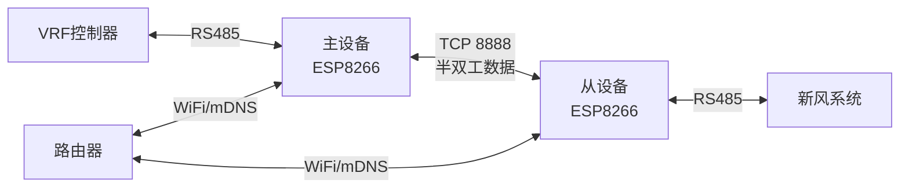

# WiFly485 架构文档

## 1. 系统概述

WiFly485是一个基于ESP8266的RS485 WiFi中继系统，旨在解决VRF控制器与新风系统之间的通信距离限制和布线困难问题。该系统采用主从架构设计，通过WiFi网络实现两端RS485信号的透明传输，提供稳定可靠的无线通信链路。

### 1.1 核心功能
- RS485信号半双工透明传输
- WiFi网络连接与mDNS自动发现
- 主从设备配置同步
- 统一的本地Web管理界面
- 自动重连和错误恢复机制

### 1.2 设计目标
- 简化安装配置过程，降低维护成本
- 提供稳定可靠的通信链路
- 支持自动化的设备发现与配置
- 实现透明的数据转发，不解析数据内容

## 2. 架构设计

### 2.1 主从架构
WiFly485采用明确的主从架构，包含两个固定角色的设备：



### 2.2 角色定义
| 角色 | 功能 | 配置管理 | 数据流向 |
|------|------|----------|----------|
| 主设备 | 连接VRF控制器 | 配置源 | 半双工透明转发VRF↔新风系统数据 |
| 从设备 | 连接新风系统 | 配置接收方 | 半双工透明转发新风系统↔VRF控制器数据 |

### 2.3 通信流程
1. **主设备接收VRF数据** → 切换到发送模式 → 通过TCP发送到从设备 → 从设备通过RS485发送到新风系统
2. **从设备接收新风数据** → 切换到发送模式 → 通过TCP发送到主设备 → 主设备通过RS485发送到VRF控制器
3. **方向管理**：自动管理RS485总线方向，确保数据正确传输

## 3. 技术栈

### 3.1 硬件组件
- **主控芯片**：ESP8266EX
- **RS485模块**：SP3485半双工RS-485收发器
- **网络连接**：2.4GHz WiFi (802.11 b/g/n)

### 3.3 引脚定义

#### ESP8266与RS485模块连接
| ESP8266引脚 | RS485模块引脚 | 功能描述 |
|------------|---------------|----------|
| GPIO4 | RTS | 方向控制（高电平发送，低电平接收） |
| GPIO1 | RX-1 | 发送数据到RS485模块 |
| GPIO3 | TX-0 | 从RS485模块接收数据 |
| 3V3 | VCC | 电源（3-5V） |
| GND | GND | 地线 |

### 3.2 软件框架
- **开发框架**：Arduino for ESP8266
- **网络协议**：
  - TCP/IP用于设备间通信
  - mDNS用于服务发现
  - HTTP用于Web管理界面
- **配置管理**：JSON格式配置文件，存储在SPIFFS文件系统中

### 3.3 开发工具
- **编译工具**：PlatformIO
- **版本控制**：Git + GitHub Flow

## 4. 目录结构

```
WiFly485/
├── .gitignore              # Git忽略文件配置
├── platformio.ini          # PlatformIO项目配置文件
├── README.md               # 项目说明文档
├── requirements.md         # 需求文档
├── docs/                   # 文档目录
│   └── architecture.md     # 架构文档
├── include/                # 头文件目录
│   └── README              # 头文件目录说明
├── lib/                    # 库文件目录
│   └── README              # 库文件目录说明
├── src/                    # 源代码目录
│   └── main.cpp            # 主程序文件
└── .vscode/                # VSCode配置目录
```

### 4.1 主要目录说明
- **src/**：存放项目的主要源代码文件
- **include/**：存放项目的头文件
- **lib/**：存放项目依赖的库文件
- **docs/**：存放项目相关文档
- **.vscode/**：VSCode编辑器配置文件

## 5. 部署指南
### 5.1 硬件连接
1. **主设备**：连接VRF控制器RS485接口
2. **从设备**：连接新风系统RS485接口
3. **电源**：连接5V或3.3V电源
4. **RS485引脚连接**：
   - **RTS引脚**：连接到ESP8266 GPIO4（方向控制）
   - **RX-1引脚**：连接到ESP8266 GPIO1（发送数据）
   - **TX-0引脚**：连接到ESP8266 GPIO3（接收数据）
   - **VCC引脚**：连接到ESP8266 3V3（电源）
   - **GND引脚**：连接到ESP8266 GND（地线）
5. **检查**：确认接线正确性

### 5.2 软件配置
1. **烧录固件**：
   ```bash
   # 编译主设备
   pio run -e wifly485_master
   
   # 编译从设备
   pio run -e wifly485_slave
   ```

2. **主设备配置**：
   - 上电启动，等待热点`WiFly485_Master`
   - 连接热点，访问`192.168.4.1`
   - 配置WiFi网络参数
   - 配置RS485参数
   - 保存配置，设备自动重启

3. **从设备配置**：
   - 上电启动，等待热点`WiFly485_Slave`
   - 连接热点，访问`192.168.5.1`
   - 配置WiFi网络参数（需与主设备同一网络）
   - 保存配置，设备自动重启
   - 自动发现主设备并同步配置

### 5.3 验证测试
1. 检查LED状态指示
2. 验证网络连接
3. 验证配置同步
4. 验证半双工数据传输
5. 检查系统日志

## 6. 总结

WiFly485系统通过简洁的主从架构设计，实现了VRF控制器与新风系统之间的无线RS485通信。系统充分利用ESP8266的WiFi能力和SP3485的RS485通信能力，提供了一个稳定、可靠且易于部署的解决方案。

该架构设计考虑了单人开发的复杂度限制，采用成熟的技术栈和清晰的模块划分，使得开发、测试和维护都更加简单高效。

## 7. 单元测试架构

### 7.1 测试框架设计
为了确保系统的稳定性和可靠性，WiFly485采用单元测试驱动开发模式。测试框架具有以下特点：

- **串口交互控制**：通过串口命令控制测试执行，支持运行单个测试用例或全部测试
- **模块化测试**：每个功能模块都有对应的测试文件，便于定位问题
- **环境隔离**：使用独立的PlatformIO环境进行测试，不影响主从设备配置
- **自动化验证**：测试结果自动输出，便于持续集成

### 7.2 测试目录结构
```
src/
├── main.cpp            # 主程序文件
└── tests/              # 单元测试目录
    ├── test_runner.cpp # 测试入口文件
    ├── test_network.cpp
    ├── test_rs485.cpp
    ├── test_protocol.cpp
    └── test_utils.cpp
```

### 7.3 测试执行方式
1. **编译测试固件**：
   ```bash
   # 编译测试环境
   pio run -e test
   ```

2. **运行测试**：
   - 通过串口监视器连接设备
   - 发送命令控制测试执行：
     - `0` `all` - 运行所有测试
     - `1` - 运行网络模块测试
     - `2` - 运行RS485模块测试
     - `3` - 运行协议模块测试
     - `h` `help` - 输出菜单

3. **查看结果**：
   - 测试结果通过串口实时输出
   - 包含测试通过/失败状态、执行时间等信息

### 7.4 测试环境配置
在platformio.ini中配置了独立的测试环境：
- `[env:test]` - 专门用于单元测试的环境
- `[env:wifly485_master]` - 主设备环境
- `[env:wifly485_slave]` - 从设备环境

每个环境都有独立的编译选项和依赖配置，确保测试的准确性和主从设备功能的正确性。