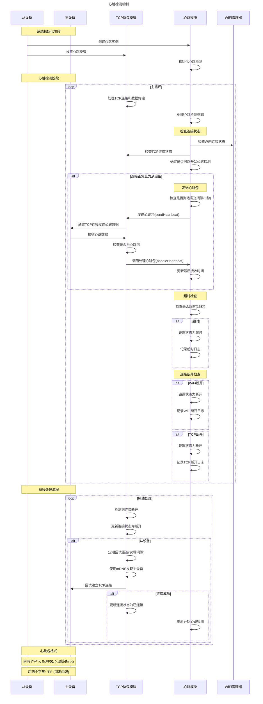

# 心跳逻辑时序图

## 参与者
- 从设备 (Slave Device)
- 主设备 (Master Device)
- TCP协议模块 (TCP Protocol)
- 心跳模块 (Heartbeat)

## 时序图

## 心跳机制说明

### 1. 初始化流程
1. 系统启动时创建Heartbeat实例
2. 将心跳模块设置到TCP协议中
3. 初始化心跳检测参数

### 2. 心跳检测流程
1. 在主循环中定期调用heartbeat.handle()
2. 检查WiFi和TCP连接状态，确定是否可以开始心跳检测
3. 对于从设备，每隔5秒发送一次心跳包
4. TCP协议在接收数据时会检查是否为心跳包
5. 如果是心跳包，则调用心跳模块的处理函数更新最后接收时间
6. 定期检查是否超时（15秒内未收到心跳响应）

### 3. 掉线检测与处理
1. **超时检测**：如果15秒内未收到心跳响应，标记为超时状态
2. **连接断开检测**：当WiFi或TCP连接断开时，立即标记为断开状态
3. **重连机制**：从设备在连接断开后会定期尝试重连（间隔30秒）
4. **mDNS发现**：重连时使用mDNS服务重新发现主设备IP地址

### 4. 关键参数
- **心跳包发送间隔**: 5秒 (HEARTBEAT_INTERVAL)
- **连接超时时间**: 15秒 (HEARTBEAT_TIMEOUT)
- **重连间隔**: 30秒 (RECONNECT_INTERVAL)
- **心跳包标识**: 0xFF01
- **心跳包内容**: "PI"

### 5. 设计特点
1. 心跳检测复用了业务通讯的TCP连接，不创建独立连接
2. 只有从设备会发送心跳包，主设备不需要发送
3. 心跳状态会影响系统的整体连接状态判断
4. 具备自动重连机制，提高系统稳定性