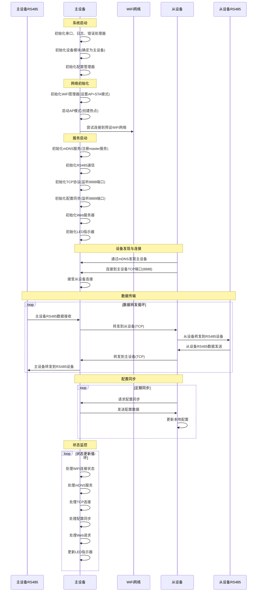

# 主设备工作逻辑分析

## 概述

本文档详细描述了WiFly485系统中主设备从启动开始的完整工作逻辑，包括初始化过程、网络连接、服务启动以及运行时的数据处理流程。

## 主设备启动工作逻辑

### 1. 系统初始化阶段

主设备启动时首先进行系统基本组件的初始化：

- 初始化串口通信（115200波特率）
- 初始化日志系统
- 初始化错误处理器
- 初始化设备模块（通过编译时宏定义确定设备角色为主设备）
- 初始化配置管理器（加载默认配置或文件配置）

### 2. 网络初始化阶段

网络初始化是主设备启动的关键步骤：

- 初始化WiFi管理器
  - 设置WiFi模式为AP+STA（同时作为接入点和站点）
  - 注册WiFi事件回调函数
- 启动WiFi接入点（AP）模式
  - 创建以设备名+“_AP”命名的热点
  - 默认密码为"wifly485"
- 尝试连接到预设的WiFi网络（如"David的iPhone"）

### 3. 服务启动阶段

在网络初始化完成后，主设备启动各项服务：

- 初始化mDNS服务
  - 注册服务名称为"wifly485-master"
  - 准备提供服务发现功能，便于从设备自动发现主设备
- 初始化RS485通信模块
  - 根据配置设置波特率等参数
  - 准备与RS485设备进行数据交换
- 初始化TCP协议模块
  - 创建TCP服务器，监听8888端口
  - 准备接收从设备的连接请求
- 初始化配置同步模块
  - 创建配置同步服务器，监听8889端口
  - 准备向从设备推送配置更新
- 初始化Web服务器
  - 提供Web配置界面，允许用户通过浏览器配置设备
- 初始化LED指示器
  - 用于显示设备状态（WiFi连接状态、TCP连接状态等）

### 4. 运行阶段

系统初始化完成后进入主循环，持续处理以下任务：

1. 处理WiFi连接状态
2. 处理mDNS服务
3. 处理TCP连接和数据传输
4. 处理配置同步
5. 处理Web服务器请求
6. 更新LED指示器状态

## 时序图

## 关键工作逻辑说明

### 1. 设备角色确定

主设备通过编译时定义的宏`DEVICE_ROLE_MASTER`确定自己的角色，这确保了设备在启动时就能正确识别自己的职责。

### 2. 网络连接

主设备同时工作在AP和STA模式：
- AP模式：创建WiFi热点，允许从设备连接
- STA模式：尝试连接到指定的WiFi网络，使主设备能够访问互联网

### 3. 服务发现

通过mDNS服务，主设备广播自己的存在，使从设备能够自动发现主设备，无需手动配置IP地址。

### 4. 数据转发

主设备作为中心节点，负责在主设备RS485设备和从设备RS485设备之间转发数据，实现透明的数据传输。主设备通过TCP连接与从设备通信，同时各自连接独立的RS485设备。

### 5. 设备发现机制

需要注意的是，主设备本身不需要通过mDNS发现其他主设备，因为主设备的角色是通过编译时定义确定的。相反，是从设备通过mDNS发现主设备：

1. 从设备启动后，通过mDNS服务查找名为"wifly485-master"的服务
2. 从设备获取主设备的IP地址和端口号
3. 从设备主动连接到主设备的TCP端口（8888）
4. 主设备接受从设备的连接请求

### 5. 配置管理

主设备负责管理配置，并可以向从设备推送配置更新，确保整个系统的配置一致性。

### 6. 状态指示

通过LED指示器显示当前设备状态（WiFi连接状态、TCP连接状态等），便于用户了解设备运行情况。