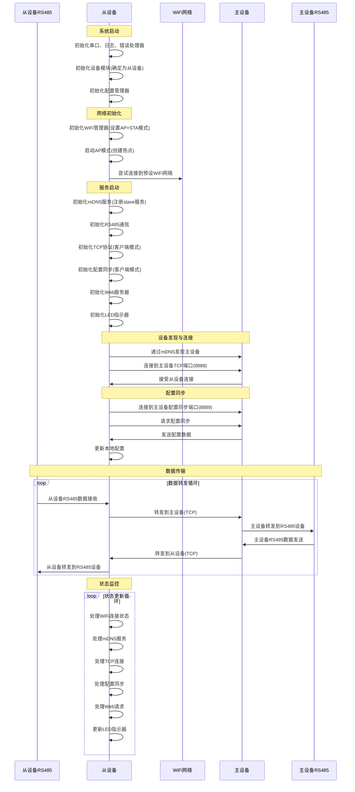

# 从设备工作逻辑分析

## 概述

本文档详细描述了WiFly485系统中从设备从启动开始的完整工作逻辑，包括初始化过程、网络连接、服务启动以及运行时的数据处理流程。从设备与主设备协同工作，实现RS485信号的无线中继传输。

## 从设备启动工作逻辑

### 1. 系统初始化阶段

从设备启动时首先进行系统基本组件的初始化：

- 初始化串口通信（115200波特率）
- 初始化日志系统
- 初始化错误处理器
- 初始化设备模块（通过编译时宏定义确定设备角色为从设备）
- 初始化配置管理器（加载默认配置或文件配置）

### 2. 网络初始化阶段

网络初始化是从设备启动的关键步骤：

- 初始化WiFi管理器
  - 设置WiFi模式为AP+STA（同时作为接入点和站点）
  - 注册WiFi事件回调函数
- 启动WiFi接入点（AP）模式
  - 创建以设备名+“_AP”命名的热点
  - 默认密码为"wifly485"
- 尝试连接到预设的WiFi网络（如"David的iPhone"）

### 3. 服务启动阶段

在网络初始化完成后，从设备启动各项服务：

- 初始化mDNS服务
  - 注册服务名称为"wifly485-slave"
  - 准备提供服务发现功能，便于主设备发现从设备
- 初始化RS485通信模块
  - 根据配置设置波特率等参数
  - 准备与RS485设备进行数据交换
- 初始化TCP协议模块
  - 作为TCP客户端，准备连接到主设备
- 初始化配置同步模块
  - 作为配置同步客户端，准备从主设备获取配置
- 初始化Web服务器
  - 提供Web配置界面，允许用户通过浏览器配置设备（仅网络配置）
- 初始化LED指示器
  - 用于显示设备状态（WiFi连接状态、TCP连接状态等）

### 4. 运行阶段

系统初始化完成后进入主循环，持续处理以下任务：

1. 处理WiFi连接状态
2. 处理mDNS服务
3. 处理TCP连接和数据传输
4. 处理配置同步
5. 处理Web服务器请求
6. 更新LED指示器状态

## 时序图

## 关键工作逻辑说明

### 1. 设备角色确定

从设备通过编译时定义的宏`DEVICE_ROLE_SLAVE`确定自己的角色，这确保了设备在启动时就能正确识别自己的职责。

### 2. 网络连接

从设备同时工作在AP和STA模式：
- AP模式：创建WiFi热点，允许用户连接进行配置
- STA模式：尝试连接到指定的WiFi网络，使从设备能够与主设备通信

### 3. 设备发现机制

从设备通过mDNS服务发现主设备：
1. 从设备启动后，通过mDNS服务查找名为"wifly485-master"的服务
2. 从设备获取主设备的IP地址和端口号
3. 从设备主动连接到主设备的TCP端口（8888）
4. 主设备接受从设备的连接请求

### 4. 配置同步

从设备启动后会主动连接到主设备的配置同步端口（8889），请求配置同步。主设备将配置数据发送给从设备，从设备更新本地配置。这个过程确保了从设备与主设备配置的一致性。

### 5. 数据转发

从设备作为中继节点，负责在主设备RS485设备和从设备RS485设备之间转发数据，实现透明的数据传输。从设备通过TCP连接与主设备通信，同时各自连接独立的RS485设备。

### 6. 状态指示

通过LED指示器显示当前设备状态（WiFi连接状态、TCP连接状态等），便于用户了解设备运行情况。

## 与主设备的主要区别

1. **角色不同**：从设备作为客户端连接到主设备，而不是作为服务器接受连接
2. **配置管理**：从设备主要从主设备同步配置，不能独立修改设备角色等关键配置
3. **Web界面**：从设备的Web界面功能受限，主要提供网络配置功能
4. **服务注册**：从设备注册为"wifly485-slave"服务，而不是"wifly485-master"