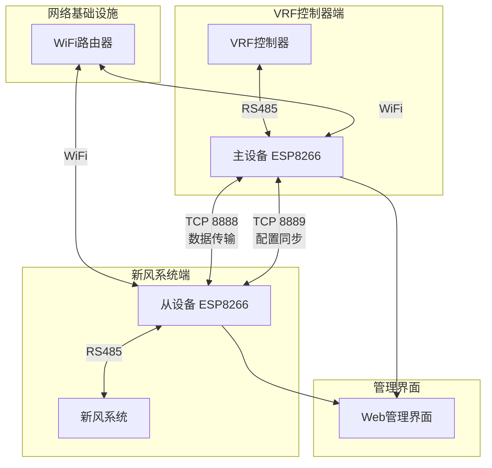
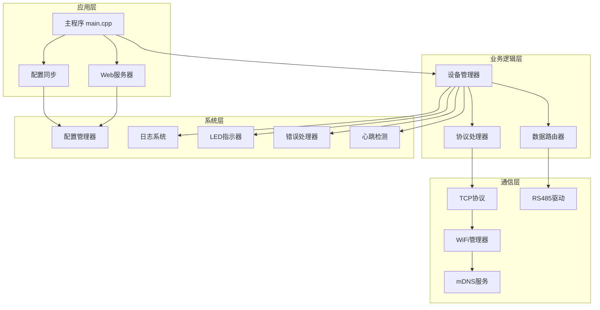
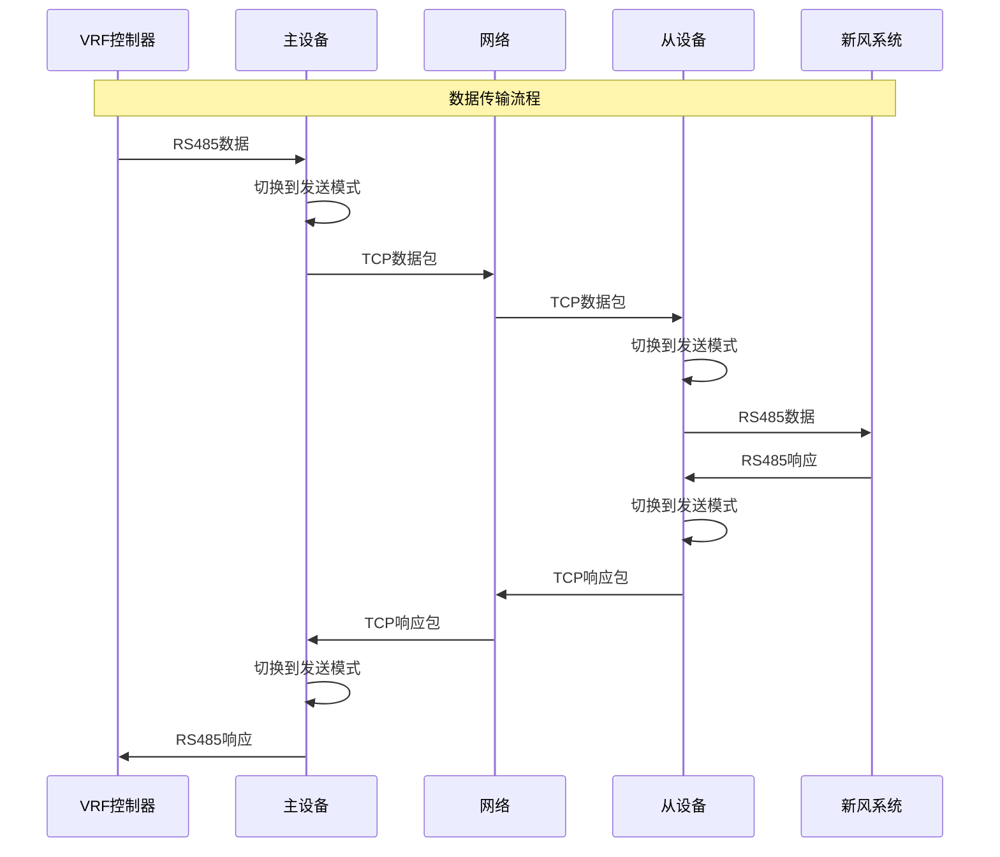
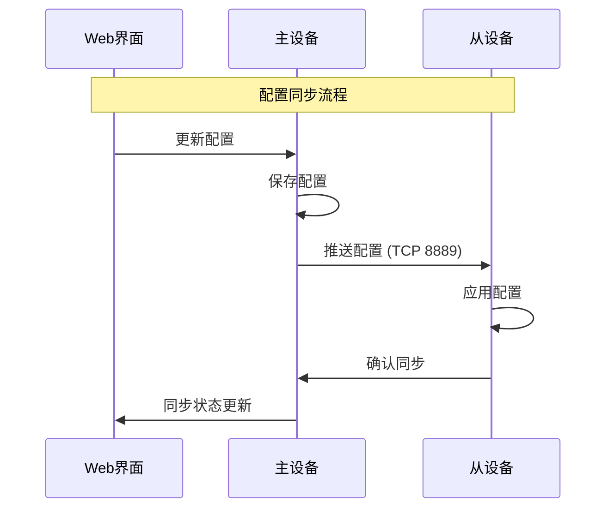
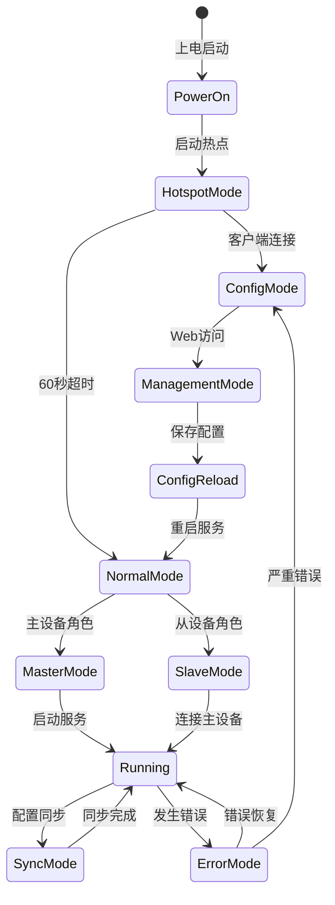
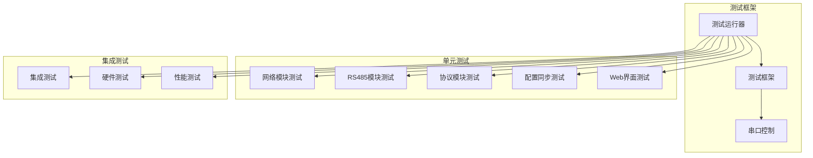
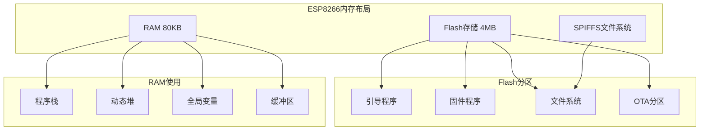
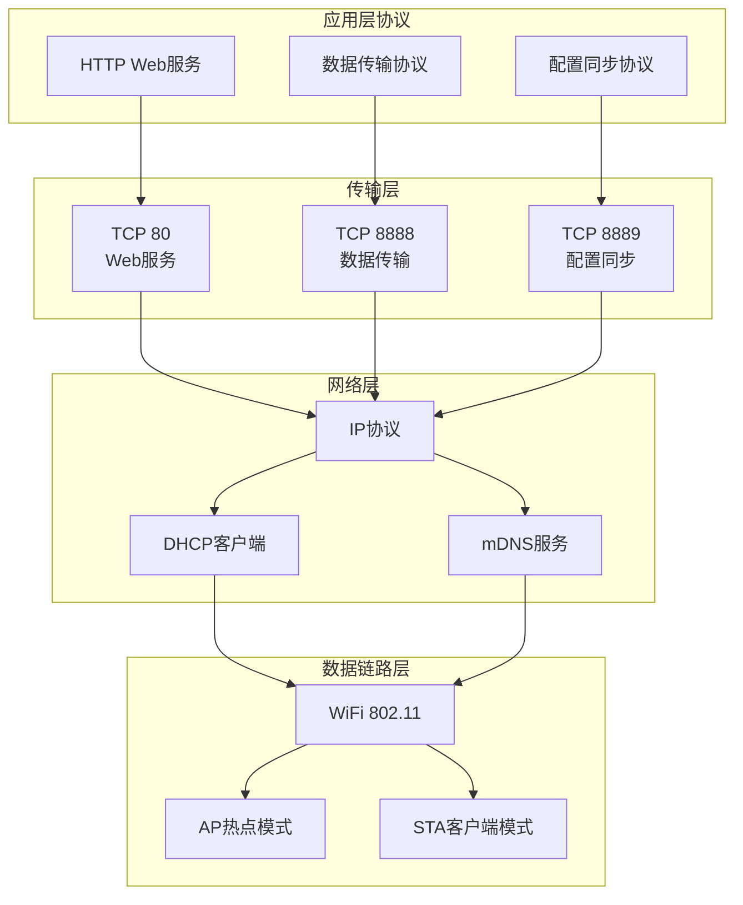
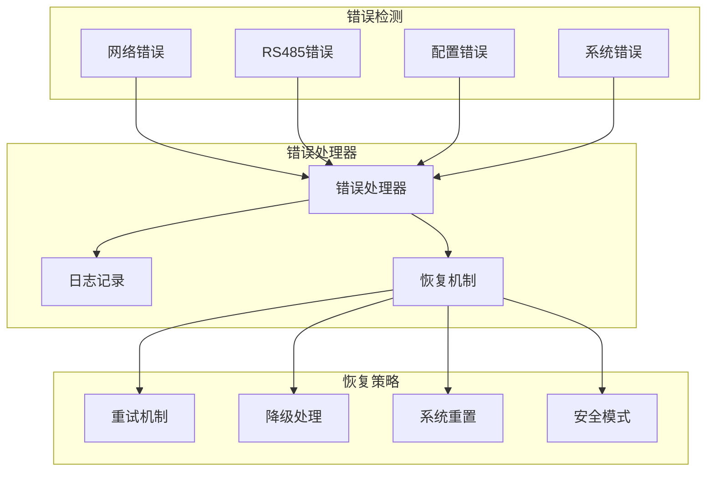
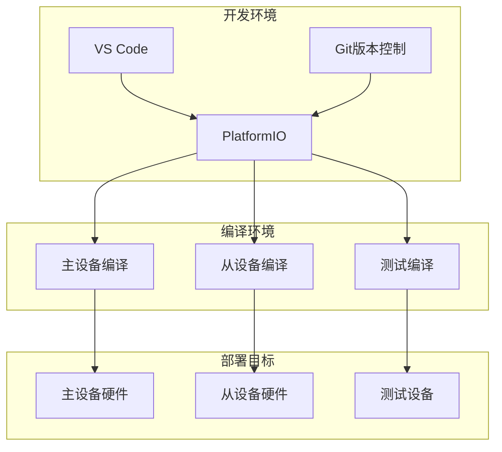

# WiFly485 系统架构图

## 1. 整体系统架构

## 2. 软件模块架构

## 3. 数据流架构

## 4. 配置同步架构

## 5. 状态机架构

## 6. 测试架构

## 7. 内存布局

## 8. 网络协议栈

## 9. 错误处理架构

## 10. 部署架构

这个系统架构文档提供了WiFly485项目的完整技术视图，包括：

1. **整体架构**：展示了VRF控制器、主从设备、网络基础设施的关系
2. **软件模块**：详细的分层架构设计
3. **数据流**：RS485数据如何通过WiFi网络传输
4. **配置同步**：主从设备配置同步机制
5. **状态机**：设备启动和运行状态转换
6. **测试架构**：完整的测试框架设计
7. **内存布局**：ESP8266的内存使用规划
8. **网络协议**：完整的网络协议栈
9. **错误处理**：系统错误检测和恢复机制
10. **部署架构**：从开发到部署的完整流程

这些图表将帮助您在开发过程中更好地理解系统的各个组件如何协同工作。