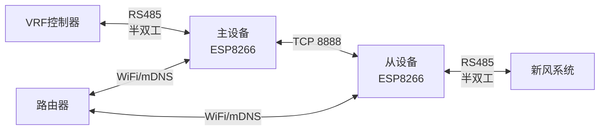
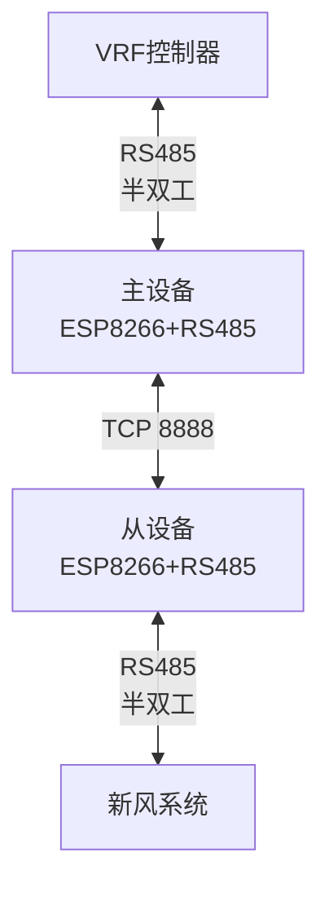
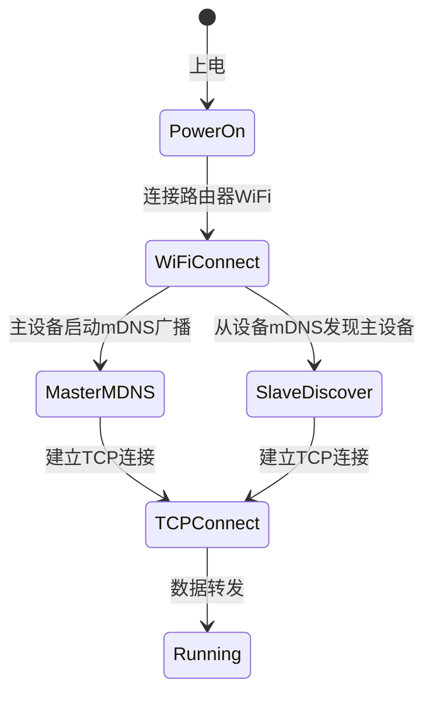
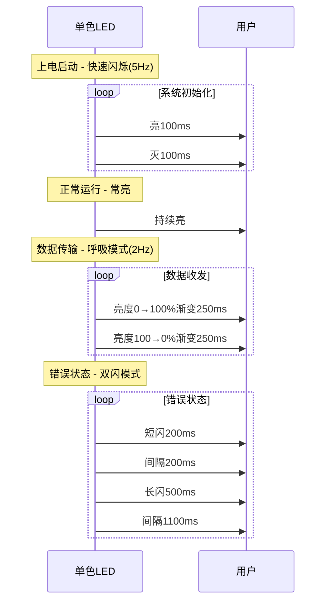

# WiFly485 - RS485 WiFi 中继系统需求文档

## 0. 硬件定义
- **ESP8266**：ESP8266开发板_CH340_TYPE-C
- **RS485**：BOB-10124 SP3485 RS-485 Breakout

## 1. 项目概述

### 1.1 项目背景
本项目旨在通过ESP8266+RS485硬件组合，实现VRF控制器与远程新风系统之间的无线通信中继。系统采用一主一从架构，通过WiFi网络将两端的RS485信号进行透明传输，解决传统有线连接的距离限制和布线困难问题。

### 1.2 项目目标
- 实现VRF控制器与新风系统之间的RS485信号无线中继
- 提供稳定可靠的通信链路，支持自动重连和错误恢复
- 通过mDNS实现主从设备自动发现
- 简化安装配置过程，降低维护成本

## 2. 系统架构

### 2.1 一主一从架构
系统采用明确的主从架构，两个设备角色固定：


```mermaid
graph LR
    A[VRF控制器] <-->|RS485<br>半双工| B[主设备<br>ESP8266]
    C[从设备<br>ESP8266] <-->|RS485<br>半双工| D[新风系统]
    B <-->|TCP 8888| C
    
    E[路由器] <-->|WiFi/mDNS| B
    E <-->|WiFi/mDNS| C
```

### 2.2 硬件模块
- **主设备**：ESP8266 + RS485
- **从设备**：ESP8266 + RS485
- **网络设备**：无线路由器（支持2.4GHz WiFi）

### 2.3 RS485模块特性
- **芯片**：SP3485半双工RS-485收发器
- **工作电压**：+3.3VDC单电源供电
- **通信速率**：最高10Mbps
- **保护功能**：-7V到+12V共模输入电压范围，短路保护
- **总线能力**：支持最多32个收发器

### 2.4 半双工通信说明
- **通信模式**：同一时刻只能单向通信（发送或接收）
- **方向控制**：通过RTS线控制Driver/Receiver Enable（DE/RE引脚）
- **透明转发**：不解析数据内容，直接透明转发
- **时序管理**：自动管理收发方向切换

## 3. 功能需求

### 3.1 基础功能
- [x] RS485信号半双工透明传输
- [x] WiFi网络连接（DHCP）
- [x] mDNS服务发现
- [x] 心跳检测机制

### 3.2 通信功能
- [x] TCP/IP socket通信
- [x] 数据缓冲机制
- [x] 流量控制
- [x] mDNS自动发现
- [x] 方向控制管理

## 4. 技术规格

### 4.1 硬件规格
组件 | 规格要求 |
|------|----------|
主控芯片 | ESP8266EX |
工作电压 | 3.3V |
RS485模块 | SP3485 |
通信速率 | 1200-115200 bps（最高10Mbps） |
工作温度 | -20°C ~ +70°C |

### 4.2 RS485模块规格
参数 | 规格 |
|------|------|
收发器芯片 | SP3485半双工 |
工作电压 | 3-5VDC单电源 |
逻辑兼容 | +5.0V逻辑电平 |
共模范围 | -7V到+12V |
保护功能 | 短路保护 |
接口标记 | RX-1, TX-0, RTS, A, B, G, VCC, GND |

### 4.3 网络规格
参数 | 规格 |
|------|------|
WiFi标准 | 802.11 b/g/n |
频率 | 2.4GHz |
安全模式 | WPA/WPA2 |
IP获取 | DHCP（强制） |
服务发现 | mDNS |
数据传输 | TCP 8888端口 |

### 4.4 RS485规格
参数 | 规格 |
|------|------|
通信标准 | TIA/EIA-485 |
收发器 | SP3485半双工 |
波特率 | 9600 bps（可配置） |
数据位 | 8位 |
停止位 | 1位 |
校验位 | 无 |
终端电阻 | 120Ω（可选） |
方向控制 | RTS引脚控制 |
接口标记 | RX-1, TX-0, RTS, A, B, G |

## 5. 主从架构设计

### 5.1 角色定义
角色 | 功能 | 数据流向 |
|------|------|----------|
主设备 | 连接VRF控制器 | 透明转发VRF↔新风系统数据 |
从设备 | 连接新风系统 | 透明转发新风系统↔VRF控制器数据 |

### 5.2 透明传输机制

#### 5.2.1 数据流架构

```mermaid
graph TD
    A[VRF控制器] <-->|RS485<br>半双工| B[主设备<br>ESP8266+RS485]
    C[从设备<br>ESP8266+RS485] <-->|RS485<br>半双工| D[新风系统]
    B <-->|TCP 8888| C
```

#### 5.2.2 RS485模块连接
- **RTS引脚**：连接到ESP8266的GPIO4引脚（方向控制）
- **RX-1引脚**：连接到ESP8266 GPIO1引脚（发送数据）
- **TX-0引脚**：连接到ESP8266 GPIO3引脚（接收数据）
- **A/B/G引脚**：RS485总线连接（A=正极，B=负极，G=地线）
- **VCC/GND**：3-5V电源和地

#### 5.2.3 半双工通信实现
- **方向控制**：通过RTS引脚（GPIO）控制RS485收发方向
- **发送模式**：RTS=高电平（启用发送器）
- **接收模式**：RTS=低电平（启用接收器）
- **自动切换**：软件自动管理方向切换
- **时序管理**：确保数据完整性
- **电路板标记**：使用实际电路板标记RX-1和TX-0

#### 5.2.4 数据转发流程
1. **主设备接收VRF数据** → 切换到发送模式 → 通过TCP发送到从设备 → 从设备通过RS485发送到新风系统
2. **从设备接收新风数据** → 切换到发送模式 → 通过TCP发送到主设备 → 主设备通过RS485发送到VRF控制器
3. **方向管理**：自动管理RS485总线方向，确保数据正确传输

## 7. 系统启动流程

### 7.1 启动状态机

```mermaid
stateDiagram-v2
    [*] --> PowerOn: 上电
    PowerOn --> WiFiConnect: 连接路由器WiFi
    
    WiFiConnect --> MasterMDNS: 主设备启动mDNS广播
    WiFiConnect --> SlaveDiscover: 从设备mDNS发现主设备
    
    MasterMDNS --> TCPConnect: 建立TCP连接
    SlaveDiscover --> TCPConnect: 建立TCP连接
    
    TCPConnect --> Running: 数据转发
```

### 7.2 启动流程详细步骤

#### 7.2.1 主设备启动流程
1. **上电启动**（< 2秒）
   - 初始化硬件
   - 初始化RS485模块

2. **连接路由器WiFi**
   - 连接到预设的路由器WiFi网络
   - 获取IP地址

3. **启动mDNS服务**
   - 启动mDNS服务广播
   - 等待从设备连接

#### 7.2.2 从设备启动流程
1. **上电启动**（< 2秒）
   - 初始化硬件

   - 初始化RS485模块

2. **连接路由器WiFi**
   - 连接到预设的路由器WiFi网络
   - 获取IP地址

3. **发现主设备**
   - 通过mDNS服务发现主设备
   - 获取主设备IP地址和端口

4. **建立TCP连接**
   - 与主设备建立TCP连接
   - 开始数据转发

## 8. 网络通信协议

### 8.1 数据传输协议
- **传输方式**：基于TCP的可靠数据传输
- **端口定义**：使用TCP 8888端口进行数据传输
- **数据格式**：原始RS485数据直接封装在TCP数据包中
- **流控制**：通过TCP协议自身的流控制机制实现


### 8.3 心跳协议
- **传输方式**：基于TCP的心跳检测
- **端口定义**：与数据传输共用TCP 8888端口
- **心跳间隔**：默认30秒发送一次心跳包
- **超时处理**：连续3次未收到心跳包则认为连接断开

## 9. 状态指示

### 9.1 LED状态标准（单色LED实现）
由于硬件限制，系统使用单色LED通过不同的闪烁和呼吸模式来表达各种状态：

| 状态阶段 | LED模式 | 闪烁频率 | 占空比 | 说明 |
|----------|---------|----------|--------|------|
| **上电启动** | 快速闪烁 | 5Hz | 50% | 系统初始化中，硬件自检 |
| **正常运行** | 常亮 | 0Hz | 100% | 设备正常运行，已连接WiFi |
| **数据传输** | 呼吸模式 | 2Hz渐变 | 0-100%渐变 | RS485有数据收发，亮度渐变 |
| **错误状态** | 双闪模式 | 0.5Hz双闪 | 短闪200ms+间隔200ms+长闪500ms | 系统错误或连接失败 |
| **WiFi连接中** | 中等闪烁 | 2Hz | 50% | 正在连接WiFi网络 |
| **主从连接中** | 中等闪烁 | 3Hz | 50% | 从设备正在寻找主设备 |

### 9.2 LED模式详细定义

#### 9.2.1 闪烁模式时序图

```mermaid
sequenceDiagram
    participant LED as 单色LED
    participant User as 用户
    
    Note over LED: 上电启动 - 快速闪烁(5Hz)
    loop 系统初始化
        LED->>User: 亮100ms
        LED->>User: 灭100ms
    end
    
    Note over LED: 正常运行 - 常亮
    LED->>User: 持续亮
    
    Note over LED: 数据传输 - 呼吸模式(2Hz)
    loop 数据收发
        LED->>User: 亮度0→100%渐变250ms
        LED->>User: 亮度100→0%渐变250ms
    end
    
    Note over LED: 错误状态 - 双闪模式
    loop 错误状态
        LED->>User: 短闪200ms
        LED->>User: 间隔200ms
        LED->>User: 长闪500ms
        LED->>User: 间隔1100ms
    end
```

#### 9.2.2 状态优先级
当多个状态同时存在时，按以下优先级显示：
1. **错误状态**（最高优先级）
2. **数据传输**
3. **WiFi连接中/主从连接中**
4. **正常运行**（最低优先级）

### 9.3 串口输出
- **启动信息**：设备角色、固件版本、配置信息
- **连接状态**：WiFi连接状态、主从设备连接状态
- **错误信息**：详细错误描述、错误代码
- **调试信息**：LED状态变更记录、模式切换日志

### 9.4 状态恢复机制
- **模式切换**：平滑过渡，避免LED闪烁突变
- **错误恢复**：错误状态清除后自动恢复正常状态指示

## 10. 编译配置

### 10.1 PlatformIO配置
```ini
[env:wifly485_master]
platform = espressif8266
board = esp12e
framework = arduino
lib_deps =
    ESP8266mDNS
build_flags =
    -DDEVICE_ROLE_MASTER
    -DDEVICE_NAME="WiFly485_Master"

[env:wifly485_slave]
platform = espressif8266
board = esp12e
framework = arduino
lib_deps =
    ESP8266mDNS
build_flags =
    -DDEVICE_ROLE_SLAVE
    -DDEVICE_NAME="WiFly485_Slave"
```

### 10.2 编译时宏定义
宏定义 | 功能 |
|--------|------|
`DEVICE_ROLE_MASTER` | 编译为主设备 |
`DEVICE_ROLE_SLAVE` | 编译为从设备 |
`DEVICE_NAME` | 设备名称 |

## 11. 部署指南

### 11.1 硬件连接
1. **主设备**：连接VRF控制器RS485接口
2. **从设备**：连接新风系统RS485接口
3. **电源**：连接5V或3.3V电源
4. **检查**：确认接线正确性

### 11.2 网络配置
1. **烧录固件**：
   ```bash
   # 编译主设备
   pio run -e wifly485_master
   
   # 编译从设备
   pio run -e wifly485_slave
   ```

2. **网络参数配置**：
   - 通过配置文件或代码中预设WiFi网络参数
   - 确保主从设备连接到同一WiFi网络

### 11.3 验证测试
1. 检查LED状态指示
2. 验证网络连接
3. 验证主从设备连接
4. 验证数据传输
5. 检查系统日志

## 12. 故障排除

故障现象 | 可能原因 | 解决方法 |
|----------|----------|----------|
无法发现主设备 | 网络不同 | 检查WiFi连接 |
连接失败 | 主设备未启动 | 检查主设备状态 |
数据传输中断 | RS485连接问题 | 检查物理连接 |

## 13. RS485模块详细说明

### 13.1 引脚定义
引脚 | 功能 | 电路板标记 | 连接说明 |
|------|------|------------|----------|
VCC | 电源 | VCC | 3-5V电源输入 |
GND | 地 | GND | 连接到ESP8266 GND |
RX-1 | 接收数据 | RX-1 | 连接到ESP8266 GPIO1引脚 |
TX-0 | 发送数据 | TX-0 | 连接到ESP8266 GPIO3引脚 |
RTS | 方向控制 | RTS | 连接到ESP8266 GPIO4引脚 |
A | RS485+ | A | RS485总线正极 |
B | RS485- | B | RS485总线负极 |
G | RS485地 | G | RS485总线地线 |

### 13.2 方向控制实现
- **控制信号**：RTS引脚（GPIO4引脚）控制RS485收发方向
- **发送模式**：RTS=高电平（启用发送器）
- **接收模式**：RTS=低电平（启用接收器）
- **硬件连接**：RTS引脚直接控制RS485模块的方向
- **默认状态**：接收模式（RTS=低电平）
- **切换延迟**：发送完成后延迟1ms切换回接收模式


### 13.3 通信时序
- **发送时序**：数据发送前RTS信号提前1ms置高
- **接收时序**：数据发送完成后RTS信号延迟1ms置低
- **切换延迟**：方向切换时需保证至少1ms的稳定时间
- **数据完整性**：确保完整数据包发送完成后才切换方向

### 13.4 电气特性
- **工作电压**：3.3V单电源
- **逻辑兼容**：5V逻辑电平兼容
- **共模范围**：-7V到+12V
- **短路保护**：内置保护电路

## 14. 命名规范

### 14.1 产品命名统一规范
为确保品牌一致性，所有产品相关命名统一使用"WiFly485"作为前缀：

| 项目 | 命名规范 | 示例 |
|------|----------|------|
| **产品名称** | WiFly485 | WiFly485 - RS485 WiFi中继系统 |
| **设备角色** | WiFly485_Master / WiFly485_Slave | WiFly485_Master, WiFly485_Slave |
| **设备名称** | WiFly485_[角色] | WiFly485_Master, WiFly485_Slave |
| **mDNS域名** | wifly485-[角色].local | wifly485-master.local, wifly485-slave.local |
| **主机名** | wifly485-[角色] | wifly485-master, wifly485-slave |


### 14.2 命名规范实施
- **代码实现**：在代码中使用统一的命名规范
- **配置文件**：配置文件中的默认值符合命名规范
- **日志输出**：日志和调试信息中使用WiFly485标识
- **文档注释**：文档和注释中使用WiFly485作为产品名称

### 14.3 实现要求
- 所有用户可见的界面元素必须使用上述命名规范
- 配置文件中的默认值必须符合命名规范
- 日志输出和调试信息中统一使用WiFly485标识
- 文档和注释中统一使用WiFly485作为产品名称

---
**文档状态**：最终统一版本
**最后更新**：2025-08-20
**版本**：统一版