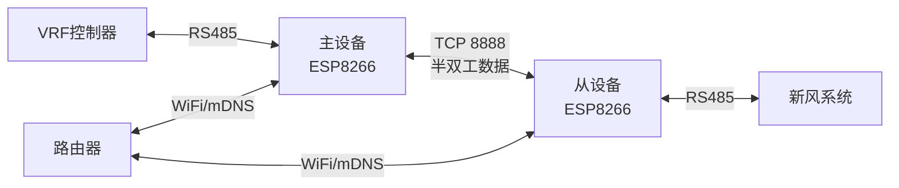
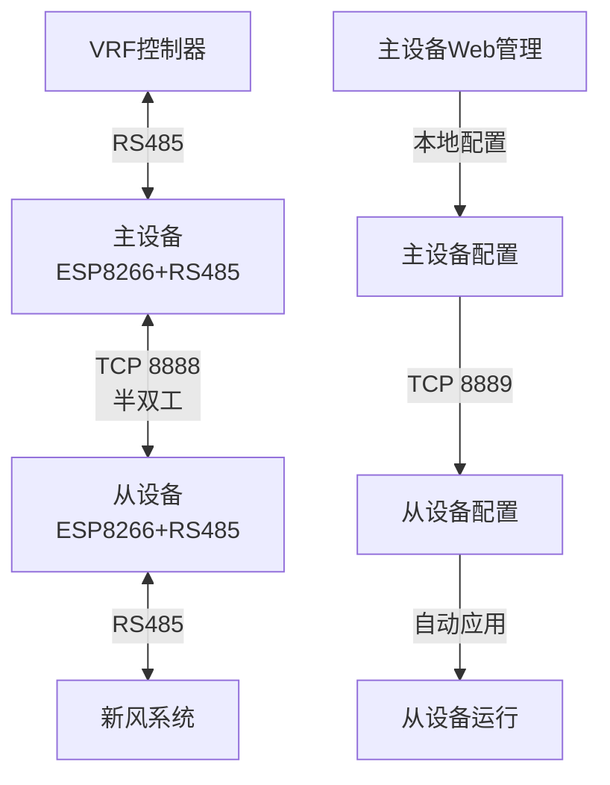
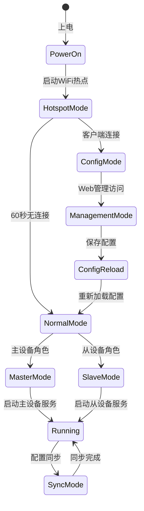
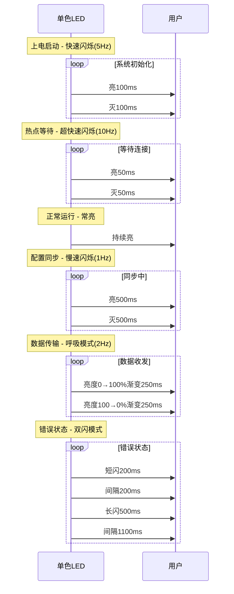

# WiFly485 - RS485 WiFi 中继系统需求文档

## 0. 硬件定义
- **ESP8266**：ESP8266开发板_CH340_TYPE-C
- **RS485**：BOB-10124 SP3485 RS-485 Breakout

## 1. 项目概述

### 1.1 项目背景
本项目旨在通过ESP8266+RS485硬件组合，实现VRF控制器与远程新风系统之间的无线通信中继。系统采用一主一从架构，通过WiFi网络将两端的RS485信号进行透明传输，解决传统有线连接的距离限制和布线困难问题。

### 1.2 项目目标
- 实现VRF控制器与新风系统之间的RS485信号无线中继
- 提供稳定可靠的通信链路，支持自动重连和错误恢复
- 通过mDNS实现主从设备自动发现
- 支持配置同步，从设备自动同步主设备配置
- 提供统一的本地Web管理界面
- 简化安装配置过程，降低维护成本

## 2. 系统架构

### 2.1 一主一从架构
系统采用明确的主从架构，两个设备角色固定：



### 2.2 硬件模块
- **主设备**：ESP8266 + RS485
- **从设备**：ESP8266 + RS485
- **网络设备**：无线路由器（支持2.4GHz WiFi）

### 2.3 RS485模块特性
- **芯片**：SP3485半双工RS-485收发器
- **工作电压**：+3.3VDC单电源供电
- **通信速率**：最高10Mbps
- **接口**：RJ-45连接器、3.5mm螺丝端子、0.1"间距排针
- **保护功能**：-7V到+12V共模输入电压范围，短路保护
- **总线能力**：支持最多32个收发器

### 2.4 半双工通信说明
- **通信模式**：同一时刻只能单向通信（发送或接收）
- **方向控制**：通过RTS线控制Driver/Receiver Enable（DE/RE引脚）
- **透明转发**：不解析数据内容，直接透明转发
- **时序管理**：自动管理收发方向切换

## 3. 功能需求

### 3.1 基础功能
- [x] RS485信号半双工透明传输
- [x] WiFi网络连接（DHCP）
- [x] mDNS服务发现
- [x] 心跳检测机制
- [x] 配置参数管理
- [x] WiFi热点配置模式
- [x] 配置同步（主从架构）
- [x] 本地Web管理界面

### 3.2 通信功能
- [x] TCP/IP socket通信
- [x] 半双工数据传输
- [x] 数据缓冲机制
- [x] 流量控制
- [x] mDNS自动发现
- [x] 配置同步协议
- [x] 方向控制管理

### 3.3 管理功能
- [x] 配置参数读写
- [x] 系统状态监控
- [x] 错误日志记录
- [x] 本地Web配置界面
- [x] 管理模式（暂停其他功能）
- [x] 配置热重载
- [x] 主从配置同步

## 4. 技术规格

### 4.1 硬件规格
| 组件 | 规格要求 |
|------|----------|
| 主控芯片 | ESP8266EX |
| 工作电压 | 3.3V |
| RS485模块 | SP3485 |
| 通信速率 | 1200-115200 bps（最高10Mbps） |
| 工作温度 | -20°C ~ +70°C |
| 接口类型 | RJ-45 + 3.5mm螺丝端子 + 0.1"排针 |

### 4.2 RS485模块规格
| 参数 | 规格 |
|------|------|
| 收发器芯片 | SP3485半双工 |
| 工作电压 | 3-5VDC单电源 |
| 逻辑兼容 | +5.0V逻辑电平 |
| 共模范围 | -7V到+12V |
| 总线容量 | 最多32个收发器 |
| 保护功能 | 短路保护 |
| 接口标记 | RX-1, TX-0, RTS, A, B, G, VCC, GND |
| 接口选项 | RJ-45、3.5mm螺丝端子、0.1"排针 |

### 4.3 网络规格
| 参数 | 规格 |
|------|------|
| WiFi标准 | 802.11 b/g/n |
| 频率 | 2.4GHz |
| 安全模式 | WPA/WPA2 |
| IP获取 | DHCP（强制） |
| 服务发现 | mDNS |
| 数据传输 | TCP 8888端口（半双工） |
| 配置同步 | TCP 8889端口 |

### 4.4 RS485规格
| 参数 | 规格 |
|------|------|
| 通信标准 | TIA/EIA-485 |
| 收发器 | SP3485半双工 |
| 波特率 | 9600 bps（可配置） |
| 数据位 | 8位 |
| 停止位 | 1位 |
| 校验位 | 无 |
| 终端电阻 | 120Ω（可选） |
| 方向控制 | RTS引脚控制 |
| 接口标记 | RX-1, TX-0, RTS, A, B, G |

## 5. 主从架构设计

### 5.1 角色定义
| 角色 | 功能 | 配置管理 | 数据流向 |
|------|------|----------|----------|
| 主设备 | 连接VRF控制器 | 配置源 | 半双工透明转发VRF↔新风系统数据 |
| 从设备 | 连接新风系统 | 配置接收方 | 半双工透明转发新风系统↔VRF控制器数据 |

### 5.2 半双工透明传输机制

#### 5.2.1 数据流架构


#### 5.2.2 RS485模块连接
- **RTS引脚**：连接到ESP8266的GPIO引脚（方向控制）
- **RX-1引脚**：连接到ESP8266 TX引脚（发送数据）
- **TX-0引脚**：连接到ESP8266 RX引脚（接收数据）
- **A/B/G引脚**：RS485总线连接（A=正极，B=负极，G=地线）
- **VCC/GND**：3-5V电源和地

#### 5.2.3 半双工通信实现
- **方向控制**：通过RTS引脚（GPIO）控制RS485收发方向
- **发送模式**：RTS=高电平（启用发送器）
- **接收模式**：RTS=低电平（启用接收器）
- **自动切换**：软件自动管理方向切换
- **时序管理**：确保数据完整性
- **电路板标记**：使用实际电路板标记RX-1和TX-0

#### 5.2.4 数据转发流程
1. **主设备接收VRF数据** → 切换到发送模式 → 通过TCP发送到从设备 → 从设备通过RS485发送到新风系统
2. **从设备接收新风数据** → 切换到发送模式 → 通过TCP发送到主设备 → 主设备通过RS485发送到VRF控制器
3. **方向管理**：自动管理RS485总线方向，确保数据正确传输

### 5.3 配置同步机制

#### 5.3.1 同步架构
- **主设备**：配置源，通过本地Web界面管理所有参数
- **从设备**：配置接收方，自动同步主设备配置
- **独立端口**：配置同步使用TCP 8889端口，与数据传输分离

#### 5.3.2 配置同步流程
1. **主设备启动**：启动配置同步服务（端口8889）
2. **从设备启动**：通过mDNS发现主设备，建立连接
3. **初始同步**：从设备请求完整配置
4. **实时同步**：主设备配置变更时自动推送到从设备
5. **手动同步**：从设备可手动触发配置同步

#### 5.3.3 同步协议
- **协议类型**：基于TCP的简单JSON协议
- **端口**：8889（独立于数据传输端口8888）
- **消息格式**：
  ```json
  {
    "type": "config_sync",
    "role": "master|slave",
    "config": {...},
    "timestamp": "2025-08-08T06:00:00Z"
  }
  ```

## 6. 配置管理

### 6.1 配置文件结构
```json
{
  "device": {
    "role": "master|slave",
    "device_id": "unique_id",
    "device_name": "WiFly485_Master|WiFly485_Slave"
  },
  "network": {
    "ssid": "WiFi名称",
    "password": "WiFi密码",
    "ip_mode": "dhcp",
    "hostname": "wifly485-master-XXXX|wifly485-slave-XXXX"
  },
  "rs485": {
    "baud_rate": 9600,
    "data_bits": 8,
    "stop_bits": 1,
    "parity": "none",
    "direction_pin": "GPIO2"
  },
  "master": {
    "port": 8888,
    "sync_port": 8889,
    "auto_push": true
  },
  "slave": {
    "master_host": "auto",
    "master_port": 8888,
    "sync_port": 8889,
    "auto_sync": true,
    "sync_interval": 300
  },
  "heartbeat": {
    "interval": 5000,
    "timeout": 15000,
    "max_retries": 10
  }
}
```

### 6.2 配置方式
- **主设备**：通过本地Web界面配置所有参数
- **从设备**：自动同步主设备配置，仅网络参数可独立配置
- **存储**：SPIFFS文件系统
- **热重载**：配置变更后自动重启相关服务

## 7. 系统启动流程

### 7.1 启动状态机


### 7.2 启动流程详细步骤

#### 7.2.1 主设备启动流程
1. **上电启动**（< 2秒）
   - 初始化硬件
   - 加载配置文件
   - 初始化RS485模块

2. **WiFi热点模式**（最长60秒等待）
   - 启动AP模式：`WiFly485_Master_XXXX`
   - 启动Web服务器：`192.168.4.1`
   - 启动mDNS服务：`wifly485-master-XXXX.local`

3. **配置模式**（如需要）
   - 提供Web配置界面
   - 配置完成后自动重启

4. **主设备模式**
   - 连接路由器WiFi
   - 启动半双工数据传输服务（端口8888）
   - 启动配置同步服务（端口8889）
   - 初始化RS485方向控制
   - 等待从设备连接

#### 7.2.2 从设备启动流程
1. **上电启动**（< 2秒）
   - 初始化硬件
   - 加载配置文件
   - 初始化RS485模块

2. **WiFi热点模式**（最长60秒等待）
   - 启动AP模式：`WiFly485_Slave_XXXX`
   - 启动Web服务器：`192.168.4.1`
   - 启动mDNS服务：`wifly485-slave-XXXX.local`

3. **配置模式**（如需要）
   - 提供Web配置界面（仅网络参数）
   - 配置完成后自动重启

4. **从设备模式**
   - 连接路由器WiFi
   - 通过mDNS发现主设备
   - 建立配置同步连接
   - 同步主设备配置
   - 初始化RS485方向控制
   - 启动半双工数据传输客户端

## 8. Web管理界面

### 8.1 主设备管理界面
```
┌─────────────────────────────────────────┐
│  WiFly485主设备管理                       │
├─────────────────────────────────────────┤
│ [网络设置] [RS485设置] [同步设置]        │
│                                         │
│ 从设备状态:                             │
│  状态: 已连接                           │
│  地址: 192.168.1.101                    │
│  配置同步: 已同步                       │
│                                         │
│ [推送配置到从设备] [查看同步日志]        │
└─────────────────────────────────────────┘
```

### 8.2 从设备管理界面
```
┌─────────────────────────────────────────┐
│  WiFly485从设备管理                       │
├─────────────────────────────────────────┤
│ [网络设置] [同步状态]                    │
│                                         │
│ 主设备信息:                             │
│  地址: 192.168.1.100:8889               │
│  状态: 已连接                           │
│  配置同步: 已同步                       │
│                                         │
│ [立即同步配置] [查看同步日志]            │
└─────────────────────────────────────────┘
```

### 8.3 API接口

#### 8.3.1 主设备API
```javascript
// 配置管理
GET    /api/config          // 获取当前配置
POST   /api/config          // 更新配置
POST   /api/sync/push       // 推送配置到从设备
GET    /api/sync/status     // 获取同步状态

// 系统管理
POST   /api/restart         // 重启系统
POST   /api/reset           // 恢复出厂设置
```

#### 8.3.2 从设备API
```javascript
// 配置管理
GET    /api/config          // 获取当前配置（只读）
POST   /api/sync/request    // 请求主设备配置
GET    /api/sync/status     // 获取同步状态

// 网络配置
POST   /api/network         // 更新网络配置（独立配置）
```

## 9. 状态指示

### 9.1 LED状态标准（单色LED实现）
由于硬件限制，系统使用单色LED通过不同的闪烁和呼吸模式来表达各种状态：

| 状态阶段 | LED模式 | 闪烁频率 | 占空比 | 说明 |
|----------|---------|----------|--------|------|
| **上电启动** | 快速闪烁 | 5Hz | 50% | 系统初始化中，硬件自检 |
| **热点等待** | 超快速闪烁 | 10Hz | 50% | WiFi热点已启动，等待客户端连接 |
| **主设备模式** | 常亮 | 0Hz | 100% | 主设备正常运行，已连接WiFi |
| **从设备模式** | 常亮 | 0Hz | 100% | 从设备正常运行，已连接WiFi |
| **配置同步** | 慢速闪烁 | 1Hz | 50% | 正在与对端设备同步配置参数 |
| **数据传输** | 呼吸模式 | 2Hz渐变 | 0-100%渐变 | RS485有数据收发，亮度渐变 |
| **错误状态** | 双闪模式 | 0.5Hz双闪 | 短闪200ms+间隔200ms+长闪500ms | 系统错误或连接失败 |
| **WiFi连接中** | 中等闪烁 | 2Hz | 50% | 正在连接WiFi网络 |
| **主从连接中** | 中等闪烁 | 3Hz | 50% | 从设备正在寻找主设备 |
| **配置模式** | 超慢闪烁 | 0.3Hz | 50% | 处于Web配置模式 |

### 9.2 LED模式详细定义

#### 9.2.1 闪烁模式时序图


#### 9.2.2 状态优先级
当多个状态同时存在时，按以下优先级显示：
1. **错误状态**（最高优先级）
2. **配置模式**
3. **配置同步**
4. **数据传输**
5. **WiFi连接中/主从连接中**
6. **正常运行**（最低优先级）

### 9.3 串口输出
- **启动信息**：设备角色、固件版本、配置信息
- **连接状态**：WiFi连接状态、主从设备连接状态
- **同步信息**：配置同步进度、同步结果
- **错误信息**：详细错误描述、错误代码
- **调试信息**：LED状态变更记录、模式切换日志

### 9.4 状态恢复机制
- **状态记忆**：设备重启后恢复之前的运行状态
- **模式切换**：平滑过渡，避免LED闪烁突变
- **错误恢复**：错误状态清除后自动恢复正常状态指示

## 10. 编译配置

### 10.1 PlatformIO配置
```ini
[env:esp12e_master]
platform = espressif8266
board = esp12e
framework = arduino
lib_deps = 
    ESP8266mDNS
    ESP8266WebServer
build_flags =
    -DDEVICE_ROLE_MASTER
    -DDEVICE_NAME="WiFly485_Master"

[env:esp12e_slave]
platform = espressif8266
board = esp12e
framework = arduino
lib_deps =
    ESP8266mDNS
    ESP8266WebServer
build_flags =
    -DDEVICE_ROLE_SLAVE
    -DDEVICE_NAME="WiFly485_Slave"
```

### 10.2 编译时宏定义
| 宏定义 | 功能 |
|--------|------|
| `DEVICE_ROLE_MASTER` | 编译为主设备 |
| `DEVICE_ROLE_SLAVE` | 编译为从设备 |
| `DEVICE_NAME` | 设备名称 |

## 11. 部署指南

### 11.1 硬件连接
1. **主设备**：连接VRF控制器RS485接口
2. **从设备**：连接新风系统RS485接口
3. **电源**：连接5V或3.3V电源
4. **检查**：确认接线正确性

### 11.2 软件配置
1. **烧录固件**：
   ```bash
   # 编译主设备
   pio run -e esp12e_master
   
   # 编译从设备
   pio run -e esp12e_slave
   ```

2. **主设备配置**：
   - 上电启动，等待热点`WiFly485_Master_XXXX`
   - 连接热点，访问`192.168.4.1`
   - 配置WiFi网络参数
   - 配置RS485参数
   - 保存配置，设备自动重启

3. **从设备配置**：
   - 上电启动，等待热点`WiFly485_Slave_XXXX`
   - 连接热点，访问`192.168.4.1`
   - 配置WiFi网络参数（需与主设备同一网络）
   - 保存配置，设备自动重启
   - 自动发现主设备并同步配置

### 11.3 验证测试
1. 检查LED状态指示
2. 验证网络连接
3. 验证配置同步
4. 验证半双工数据传输
5. 检查系统日志

## 12. 故障排除

| 故障现象 | 可能原因 | 解决方法 |
|----------|----------|----------|
| 无法发现主设备 | 网络不同 | 检查WiFi连接 |
| 配置同步失败 | 主设备未启动 | 检查主设备状态 |
| 数据传输中断 | RS485连接问题 | 检查物理连接 |
| 配置不生效 | 未重启服务 | 手动重启设备 |

## 13. RS485模块详细说明

### 13.1 引脚定义
| 引脚 | 功能 | 电路板标记 | 连接说明 |
|------|------|------------|----------|
| VCC | 电源 | VCC | 3-5V电源输入 |
| GND | 地 | GND | 连接到ESP8266 GND |
| RX-1 | 接收数据 | RX-1 | 连接到ESP8266 TX引脚 |
| TX-0 | 发送数据 | TX-0 | 连接到ESP8266 RX引脚 |
| RTS | 方向控制 | RTS | 连接到ESP8266 GPIO引脚 |
| A | RS485+ | A | RS485总线正极 |
| B | RS485- | B | RS485总线负极 |
| G | RS485地 | G | RS485总线地线 |

### 13.2 方向控制实现
- **控制信号**：RTS引脚（GPIO引脚）控制RS485收发方向
- **发送模式**：RTS=高电平（启用发送器）
- **接收模式**：RTS=低电平（启用接收器）
- **硬件连接**：RTS引脚直接控制RS485模块的方向
- **默认状态**：接收模式（RTS=低电平）
- **切换延迟**：发送完成后延迟1ms切换回接收模式

### 13.3 接口选项
- **RJ-45连接器**：标准网络接口
- **3.5mm螺丝端子**：便于现场接线
- **0.1"排针**：面包板兼容

### 13.4 电气特性
- **工作电压**：3.3V单电源
- **逻辑兼容**：5V逻辑电平兼容
- **共模范围**：-7V到+12V
- **短路保护**：内置保护电路

## 14. 命名规范

### 14.1 产品命名统一规范
为确保品牌一致性，所有产品相关命名统一使用"WiFly485"作为前缀：

| 项目 | 命名规范 | 示例 |
|------|----------|------|
| **产品名称** | WiFly485 | WiFly485 - RS485 WiFi中继系统 |
| **设备角色** | WiFly485_Master / WiFly485_Slave | WiFly485_Master, WiFly485_Slave |
| **WiFi热点** | WiFly485_[角色]_[唯一标识] | WiFly485_Master_A1B2C3, WiFly485_Slave_D4E5F6 |
| **mDNS域名** | wifly485-[角色]-[唯一标识].local | wifly485-master-a1b2c3.local, wifly485-slave-d4e5f6.local |
| **主机名** | wifly485-[角色]-[唯一标识] | wifly485-master-a1b2c3, wifly485-slave-d4e5f6 |
| **Web界面标题** | WiFly485[角色]设备管理 | WiFly485主设备管理, WiFly485从设备管理 |

### 14.2 命名规则说明
- **唯一标识**：使用设备MAC地址后6位或随机生成的6位十六进制字符串
- **大小写规范**：WiFi热点和域名使用小写，显示名称使用首字母大写
- **分隔符**：使用下划线(_)分隔单词，使用连字符(-)分隔域名部分
- **长度限制**：WiFi热点名称不超过32字符，域名不超过63字符

### 14.3 实现要求
- 所有用户可见的界面元素必须使用上述命名规范
- 配置文件中的默认值必须符合命名规范
- 日志输出和调试信息中统一使用WiFly485标识
- 文档和注释中统一使用WiFly485作为产品名称

---
**文档状态**：最终统一版本
**最后更新**：2025-08-08
**版本**：统一版