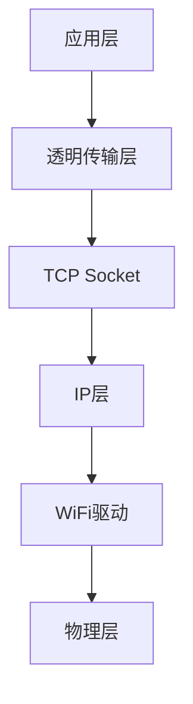
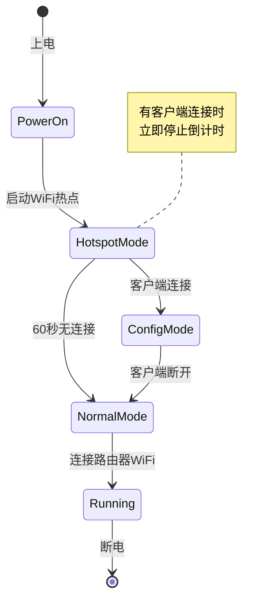
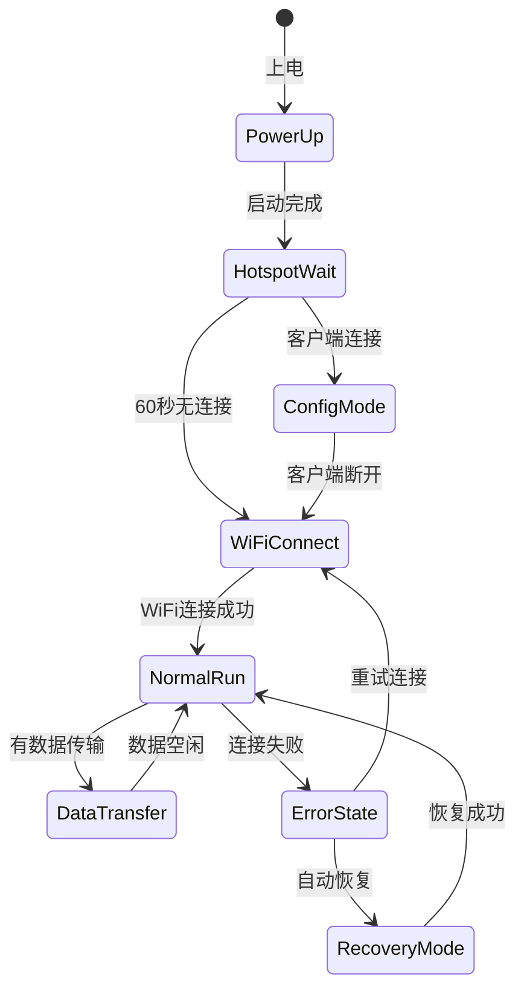

# RS485 WiFi 中继系统需求文档

## 1. 项目概述

### 1.1 项目背景
本项目旨在通过ESP8266+RS485硬件组合，实现VRF控制器与远程新风系统之间的无线通信中继。系统通过WiFi网络将两端的RS485信号进行透明传输，解决传统有线连接的距离限制和布线困难问题。

### 1.2 项目目标
- 实现VRF控制器与新风系统之间的RS485信号无线中继
- 提供稳定可靠的通信链路，支持自动重连和错误恢复
- 简化安装配置过程，降低维护成本
- 确保系统在各种网络环境下的健壮性

## 2. 系统架构

### 2.1 总体架构
系统采用统一代码架构，通过编译时宏定义区分服务端和客户端模式，两个硬件节点使用完全相同的固件：


### 2.2 统一固件设计
- **单一代码库**：服务端和客户端使用同一套代码，通过编译宏`DEVICE_MODE_SERVER`或`DEVICE_MODE_CLIENT`区分
- **功能复用**：网络管理、RS485通信、配置管理等核心功能完全复用
- **简化维护**：只需维护一套代码，降低维护成本

### 2.3 硬件组成
- **ESP8266节点**：ESP8266开发板 + RS485转换模块（服务端和客户端硬件完全相同）
- **网络设备**：无线路由器（支持2.4GHz WiFi）

## 3. 功能需求

### 3.1 基本功能
- [x] RS485信号透明传输
- [x] WiFi网络连接
- [x] 自动网络重连
- [x] 心跳检测机制
- [x] 配置参数管理
- [x] WiFi热点管理（配置模式）

### 3.2 通信功能
- [x] TCP/IP socket通信
- [x] 双向数据传输
- [x] 数据缓冲机制
- [x] 流量控制

### 3.3 管理功能
- [x] 配置参数读写
- [x] 系统状态监控
- [x] 错误日志记录
- [x] 远程诊断支持
- [x] Web配置界面（热点模式）

## 4. 技术规格

### 4.1 硬件规格
| 组件 | 规格要求 |
|------|----------|
| 主控芯片 | ESP8266EX |
| 工作电压 | 3.3V |
| RS485芯片 | MAX3485或类似 |
| 通信速率 | 1200-115200 bps |
| 工作温度 | -20°C ~ +70°C |

### 4.2 网络规格
| 参数 | 规格 |
|------|------|
| WiFi标准 | 802.11 b/g/n |
| 频率 | 2.4GHz |
| 安全模式 | WPA/WPA2 |
| IP获取 | DHCP或静态IP |

### 4.3 RS485规格
| 参数 | 规格 |
|------|------|
| 通信标准 | TIA/EIA-485 |
| 波特率 | 9600 bps（可配置） |
| 数据位 | 8位 |
| 停止位 | 1位 |
| 校验位 | 无 |
| 终端电阻 | 120Ω（可选）

## 5. 通信协议

### 5.1 网络协议栈


### 5.2 心跳机制
- **心跳间隔**：5秒
- **超时判定**：15秒无响应
- **重连策略**：指数退避，最大间隔60秒
- **心跳数据**：0xAA 0x55 + 时间戳

### 5.3 数据格式
- **传输模式**：原始字节流透传
- **数据完整性**：依赖底层TCP保证
- **流量控制**：软件流控（XON/XOFF）

## 6. 配置管理

### 6.1 配置文件结构
```json
{
  "device": {
    "role": "server|client",
    "device_id": "unique_id"
  },
  "network": {
    "ssid": "WiFi名称",
    "password": "WiFi密码",
    "ip_mode": "dhcp|static",
    "static_ip": "192.168.1.100",
    "gateway": "192.168.1.1",
    "subnet": "255.255.255.0"
  },
  "rs485": {
    "baud_rate": 9600,
    "data_bits": 8,
    "stop_bits": 1,
    "parity": "none"
  },
  "server": {
    "port": 8888,
    "max_clients": 1
  },
  "client": {
    "server_ip": "192.168.1.100",
    "server_port": 8888,
    "auto_reconnect": true
  },
  "heartbeat": {
    "interval": 5000,
    "timeout": 15000,
    "max_retries": 10
  }
}
```

### 6.2 配置方式
- **初始配置**：通过WiFi热点Web界面配置
- **运行时配置**：支持远程更新
- **配置存储**：SPIFFS文件系统
- **配置备份**：自动备份到云端

### 6.3 WiFi热点配置模式
- **热点名称**：`RS485_Repeater_XXXX`（后4位为设备ID）
- **热点密码**：`12345678`
- **管理地址**：`192.168.4.1`
- **Web端口**：80
- **热点等待策略**：
  - **最大等待时间**：60秒（仅当无客户端连接时）
  - **连接检测**：实时监控客户端连接状态
  - **立即响应**：一旦检测到客户端连接，立即停止倒计时
  - **断开处理**：客户端断开后立即关闭热点，继续正常启动流程
- **配置页面**：提供完整的网络和设备配置界面

## 7. 系统启动流程

### 7.1 启动状态机


### 7.2 启动流程详细步骤（含LED指示）

1. **上电启动**（< 2秒）
   - **LED状态**：快速闪烁（100ms亮/100ms灭）
   - 初始化硬件
   - 加载配置文件
   - 启动RS485通信

2. **WiFi热点模式**（最长60秒等待）
   - **LED状态**：超快速闪烁（50ms亮/50ms灭）
   - 启动AP模式：`RS485_Repeater_XXXX`
   - 启动Web服务器：`192.168.4.1`
   - **关键逻辑**：
     - 一旦检测到客户端连接，立即停止60秒倒计时
     - 保持热点开启直到客户端主动断开
     - 无客户端连接时，60秒后自动关闭热点

3. **配置模式**（客户端已连接）
   - **LED状态**：慢速闪烁（500ms亮/500ms灭）
   - 暂停正常启动流程
   - 提供Web配置界面
   - **客户端断开检测**：实时监控客户端连接状态
   - 客户端断开后立即关闭热点，进入下一步

4. **WiFi连接模式**
   - **LED状态**：中速闪烁（300ms亮/300ms灭）
   - 关闭热点（如仍在运行）
   - 连接配置的路由器WiFi

5. **正常运行模式**
   - **LED状态**：常亮
   - 根据角色启动服务端或客户端功能
   - 进入数据传输监控状态

6. **数据传输状态**
   - **LED状态**：呼吸灯效果（1.5秒周期渐亮渐灭）
   - 实时监控RS485数据传输
   - 空闲时保持常亮状态

### 7.3 错误处理与恢复

### 7.3.1 错误类型与LED指示
| 错误类型 | 处理方式 | LED指示 |
|----------|----------|---------|
| WiFi连接失败 | 自动重连，指数退避 | 双闪模式（错误状态） |
| TCP连接断开 | 自动重连，指数退避 | 双闪模式（错误状态） |
| RS485通信错误 | 错误计数，重启恢复 | 三闪模式（恢复模式） |
| 配置错误 | 恢复默认配置 | 双闪模式（错误状态） |
| 热点启动失败 | 重试3次后进入正常模式 | 双闪模式（错误状态） |
| 网络恢复成功 | 继续正常运行 | 恢复正常LED状态 |

### 7.3.2 恢复机制
- **看门狗**：硬件看门狗，30秒超时
- **自动重启**：连续错误10次后重启
- **配置恢复**：配置损坏时恢复出厂设置
- **日志记录**：错误日志循环存储

## 8. 状态指示

### 8.1 LED状态标准
系统使用单一LED指示灯，采用统一的闪烁模式标准：

| 状态阶段 | LED模式 | 持续时间/频率 | 说明 |
|----------|---------|---------------|------|
| **上电启动** | 快速闪烁 | 100ms亮/100ms灭 | 系统初始化中 |
| **热点等待** | 超快速闪烁 | 50ms亮/50ms灭 | WiFi热点已启动，等待连接 |
| **配置模式** | 慢速闪烁 | 500ms亮/500ms灭 | 客户端已连接，可配置 |
| **WiFi连接** | 中速闪烁 | 300ms亮/300ms灭 | 正在连接路由器WiFi |
| **正常运行** | 常亮 | 持续亮 | 已连接到路由器 |
| **数据传输** | 呼吸灯 | 1.5秒周期渐亮渐灭 | RS485有数据传输 |
| **错误状态** | 双闪模式 | 250ms亮/250ms灭×2，然后1秒灭 | 系统错误或连接失败 |
| **恢复模式** | 三闪模式 | 200ms亮/200ms灭×3，然后2秒灭 | 正在尝试自动恢复 |

### 8.2 LED状态转换图


### 8.2 串口输出
- **启动信息**：系统版本、配置信息
- **连接状态**：WiFi连接、服务器连接
- **错误信息**：详细错误描述
- **调试信息**：可选调试模式

## 9. 性能要求

### 9.1 响应时间
- **启动时间**：< 5秒
- **WiFi连接**：< 10秒
- **重连时间**：< 3秒
- **数据传输延迟**：< 50ms

### 9.2 稳定性要求
- **连续运行时间**：> 30天
- **平均无故障时间**：> 1000小时
- **数据丢失率**：< 0.01%

## 10. 测试要求

### 10.1 功能测试
- [x] RS485通信测试
- [x] WiFi连接测试
- [x] 心跳机制测试
- [x] 配置读写测试
- [x] 错误恢复测试

### 10.2 压力测试
- [x] 长时间运行测试（72小时）
- [x] 网络抖动测试
- [x] 高负载数据传输测试
- [x] 电源波动测试

### 10.3 兼容性测试
- [x] 不同路由器测试
- [x] 不同VRF控制器测试
- [x] 不同新风系统测试

## 11. 部署指南

### 11.1 硬件连接
1. 连接ESP8266与RS485模块
2. 连接RS485模块与目标设备
3. 连接电源（5V或3.3V）
4. 检查接线正确性

### 11.2 软件配置
1. 烧录固件到ESP8266（需指定编译模式）
2. 设备上电，等待WiFi热点启动
3. 用手机/电脑连接热点`RS485_Repeater_XXXX`
4. 浏览器访问`192.168.4.1`进行配置
5. 配置完成后设备自动重启并连接路由器
6. 验证系统功能

### 11.3 编译配置
```bash
# 编译服务端版本
pio run -e esp12e_server

# 编译客户端版本
pio run -e esp12e_client
```

### 11.4 现场调试
1. 检查物理连接
2. 观察LED状态确认启动流程
3. 如需要配置，等待热点启动
4. 通过Web界面进行配置
5. 验证网络连接和数据传输
6. 监控运行状态
7. 记录配置参数

## 12. 维护与支持

### 12.1 日常维护
- 定期检查LED状态
- 监控网络连接质量
- 查看系统日志
- 更新固件（如有需要）

### 12.2 故障排除
- 查看错误代码
- 检查网络设置
- 验证RS485连接
- 重启设备

### 12.3 技术支持
- 提供配置工具
- 远程诊断支持
- 固件升级服务
- 技术文档更新

## 13. 编译配置

### 13.1 PlatformIO配置
在`platformio.ini`中添加两种编译环境：

```ini
[env:esp12e_server]
platform = espressif8266
board = esp12e
framework = arduino
build_flags =
    -DDEVICE_MODE_SERVER
    -DDEVICE_NAME="RS485_Server"

[env:esp12e_client]
platform = espressif8266
board = esp12e
framework = arduino
build_flags =
    -DDEVICE_MODE_CLIENT
    -DDEVICE_NAME="RS485_Client"
```

### 13.2 编译时宏定义
| 宏定义 | 功能 |
|--------|------|
| `DEVICE_MODE_SERVER` | 编译为服务端模式 |
| `DEVICE_MODE_CLIENT` | 编译为客户端模式 |
| `DEVICE_NAME` | 设备名称，用于热点SSID |

## 14. 版本历史

| 版本 | 日期 | 变更内容 |
|------|------|----------|
| 1.0 | 2025-08-08 | 初始版本创建 |
| 1.1 | 2025-08-08 | 添加统一固件设计和WiFi热点配置功能 |

---
**文档状态**：完成
**最后更新**：2025-08-08
**作者**：David Hu <coolbor@gmail.com>